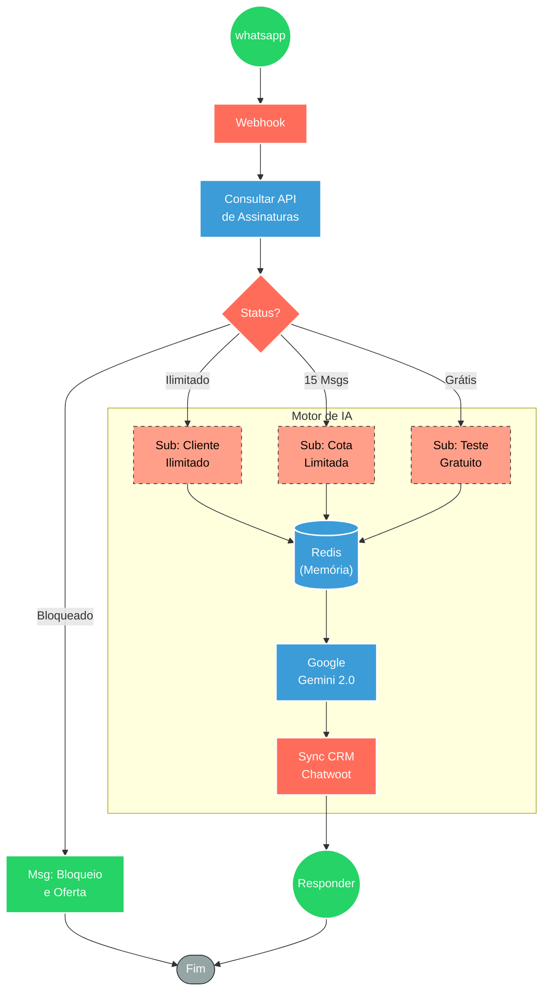

## ⚡ Sistema de Assistente Bíblico Multicanal com Gestão de Assinaturas

#### 🧠 Lógica do Processo: Este sistema atua como um orquestrador inteligente de atendimento via WhatsApp, especializado em conteúdo teológico. Ao receber uma mensagem, o fluxo principal consulta uma base de dados externa para identificar o status da assinatura do usuário (Gratuito, Limitado ou Ilimitado). Com base nessa validação, a requisição é direcionada para o sub-fluxo correspondente, garantindo o controle de uso. O núcleo de processamento utiliza o modelo Google Gemini para gerar respostas, apoiado por um banco Redis que mantém o contexto da conversa (memória). Simultaneamente, todo o histórico e gestão de contatos são sincronizados com o Chatwoot, permitindo transbordo humano e visualização centralizada do atendimento.

---

### 🏗️ Diagrama de Arquitetura:

---

### 🔍 Dicionário de Dados

#### 1. Entrada e Controle de Acesso
* **Webhook WhatsApp** `(Nó: Webhook)`
  * **Função:** Ponto de entrada da mensagem do usuário. Recebe o payload do WhatsApp (número, nome e conteúdo da mensagem) e inicia o ciclo de processamento.

* **API de Assinaturas** `(Nó: Consultar API)`
  * **Função:** O "Porteiro" do sistema. Realiza uma requisição HTTP GET para um banco de dados externo enviando o ID do usuário para verificar:
    1. Se o usuário existe.
    2. Qual o plano ativo (Gratuito, 15 Mensagens ou Ilimitado).
    3. Se o usuário ainda possui saldo de mensagens (quota).

* **Roteador de Planos** `(Nó: Switch Status)`
  * **Função:** Orquestrador lógico. Com base na resposta da API, direciona o tráfego para um dos três sub-fluxos (caminhos de sucesso) ou para o nó de bloqueio (se a assinatura estiver inativa ou quota excedida).

#### 2. Motor de Inteligência Artificial (IA)
* **Google Gemini 2.0** `(Nó: Google Gemini Chat Model)`
  * **Função:** O "Cérebro Teológico". Modelo de linguagem (LLM) configurado com *system prompts* específicos para atuar como assistente bíblico, gerando respostas baseadas em escrituras e teologia.

* **Memória Redis** `(Nó: Redis Chat Memory)`
  * **Função:** Memória de curto prazo (Context Window).
    * **Leitura:** Antes de gerar a resposta, recupera as últimas mensagens trocadas com aquele número específico para manter a coerência do diálogo.
    * **Escrita:** Após a resposta, salva a nova interação para o próximo turno da conversa.

* **Agente de IA** `(Nó: AI Agent)`
  * **Função:** Executor que une o modelo (Gemini) à memória (Redis). Gerencia a chamada à API da IA, injeta o contexto histórico e processa a saída textual.

#### 3. Gestão de Relacionamento (CRM)
* **Sync Chatwoot** `(Nó: Chatwoot)`
  * **Função:** Centralização do atendimento e Transbordo Humano.
    * **Criação de Contato:** Verifica se o número já existe no CRM; se não, cria o registro.
    * **Registro de Conversa:** Espelha toda a interação (pergunta do usuário e resposta da IA) dentro do painel do Chatwoot, permitindo auditoria ou intervenção humana.

#### 4. Fluxos Especializados (Sub-workflows)
* **Sub: Cliente Ilimitado** `(Sub_workflow_Ilimitado.json)`
  * **Regra de Negócio:** Fluxo VIP. A IA processa a resposta com prioridade, sem travas de verificação de quota, focado em velocidade e qualidade máxima.

* **Sub: Cota Limitada** `(15_msg_Sub_workflow.json)`
  * **Regra de Negócio:** Fluxo Intermediário. Processa a mensagem normalmente, mas opera sob a lógica de consumo de saldo (decremento de quota a cada interação bem-sucedida).

* **Sub: Teste Gratuito** `(Gratis_Sub_workflow.json)`
  * **Regra de Negócio:** Fluxo de Entrada. Funciona como "amostra grátis" para conversão. Possui regras rígidas de bloqueio no nó principal caso o período de teste ou número de mensagens gratuitas tenha expirado.
