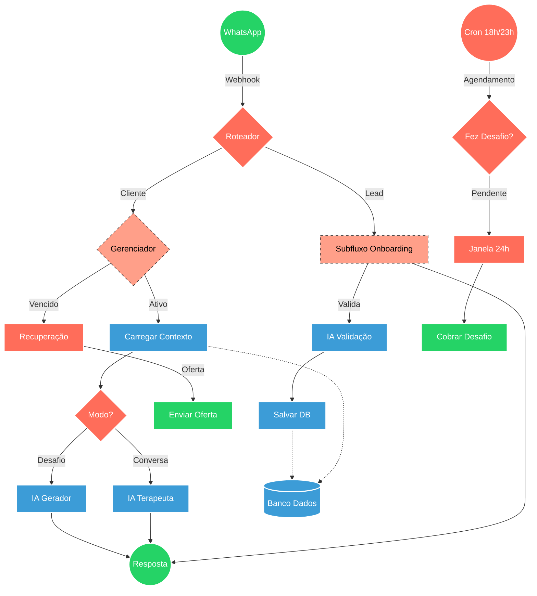

## ⚡ ECOSSISTEMA INTEGRAL - SEU CONSELHEIRO

#### 🧠 Lógica do Processo
O sistema opera como um "terapeuta de bolso" contínuo. A entrada principal tria mensagens: novos usuários vão para o Onboarding (qualificação via IA), enquanto usuários recorrentes vão para o Gerenciador Terapeuta. O Gerenciador verifica a assinatura e decide entre conversa livre ou desafio. Se a assinatura expirou, ativa-se a Recuperação. Paralelamente, gatilhos de inatividade (18h/23h) cobram a realização dos desafios para garantir a retenção.

---

### 🏗️ Diagrama de Arquitetura:

---

### 🔍 Dicionário de Dados

#### 1. Núcleo e Roteamento
* **Roteador** `(Nó: Router Principal)`
  * **Função:** Atua como o *gateway* de entrada. Identifica o tipo de mídia (áudio/texto) e segmenta o remetente entre **Leads** (novos usuários para Onboarding) e **Clientes** (usuários recorrentes para o Gerenciador).

* **Subfluxo Onboarding** `(Sub-workflow)`
  * **Função:** Executa a qualificação inicial. Coleta dados (Nome, Dores, Objetivos), valida a coerência das respostas e registra o perfil inicial no banco de dados.

* **Gerenciador** `(Nó: Gerenciador Terapeuta)`
  * **Função:** O cérebro lógico do sistema. Verifica o status da assinatura (Free, Starter, Pro, VIP), controla o acesso a recursos (ex: bloqueia áudio para planos básicos) e decide se o usuário deve receber um desafio ou entrar em conversa livre.

#### 2. Inteligência Artificial (IA)
* **IA Validação** `(OpenAI / LLM)`
  * **Função:** "Guardião" do onboarding. Analisa se o input do usuário responde à pergunta feita (ex: se o usuário digitou um nome válido ou algo sem sentido).

* **IA Gerador** `(Orimon / Gemini)`
  * **Função:** Motor do "Modo Perpétuo". Analisa o histórico dos últimos 30 dias para criar um desafio inédito e personalizado quando as trilhas fixas terminam.

* **IA Terapeuta** `(Chatbase)`
  * **Função:** Chatbot com persona psicológica configurada. Gerencia as conversas livres, oferecendo suporte emocional, validação e *insights* baseados no contexto do usuário.

#### 3. Regras de Negócio e Retenção
* **Recuperação** `(Fluxo: Mensagem Vencimento)`
  * **Função:** Ativado quando a assinatura expira. Envia mensagens persuasivas, imagens personalizadas por plano e links de checkout (Greenn) para renovação.

* **Cobrar Desafio** `(Cron: Notifica 18h/23h)`
  * **Função:** Sistema de retenção (Streak). Verifica periodicamente se o desafio do dia foi cumprido. Se não, dispara lembretes para evitar que o usuário perca o ritmo da jornada.

* **Janela 24h** `(Nó: Lógica de Tempo)`
  * **Função:** Verifica a janela de sessão do WhatsApp Business API. Garante que mensagens proativas sejam enviadas apenas dentro das regras da Meta ou via *Message Templates*.

#### 4. Infraestrutura e Dados
* **Banco Dados** `(NoCodeBackend / Redis)`
  * **Função:**
    * **Redis:** Cache de alta velocidade para contexto imediato da conversa.
    * **NoCodeBackend:** Persistência de longo prazo (perfis, status de assinatura, logs de jornada).
