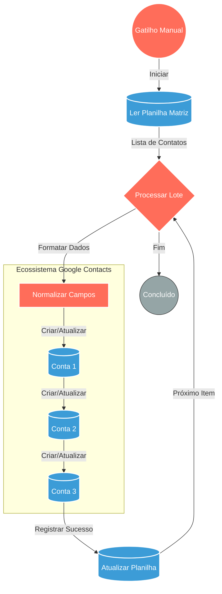

## ⚡ SINCRONIZAÇÃO DE CONTATOS MULTI-CONTA (GOOGLE)

#### 🧠 Lógica do Processo

Este fluxo automatiza a distribuição de contatos a partir de uma base centralizada (Google Sheets) para múltiplas agendas corporativas. O sistema lê novos registros na planilha "Matriz", formata os dados telefônicos e cria os contatos sequencialmente em três contas distintas do Google ("Conta 1", "Conta 2" e "Conta 3"). Após a inserção bem-sucedida, o fluxo escreve de volta na planilha original, marcando a linha com "ok" e a data/hora atual para garantir que o contato não seja processado novamente.

---

### 🏗️ Diagrama de Arquitetura

---

### 🔍 Dicionário de Dados

#### 1. Planilha Matriz (Google Sheets)

* **Função:** Atua como banco de dados principal e fila de processamento (Queue). Armazena os leads brutos e controla quais já foram importados.
* **Entrada principal:** N/A (Leitura de dados existentes).
* **Saída principal:** Dados do Lead (Nome, Email, Telefone, ID da Linha).
* **Observações:** O fluxo filtra especificamente linhas onde a coluna "Adicionado" está vazia ou diferente de "ok".

#### 2. Processador de Lote (n8n Core)

* **Função:** Itera sobre a lista de contatos recuperada para garantir o processamento individual e sequencial, evitando sobrecarga da API (Rate Limiting) e permitindo o controle de erro por item.
* **Entrada principal:** Array JSON com múltiplos contatos.
* **Saída principal:** Objeto JSON único do contato atual.

#### 3. Contas Google (Integração Google Contacts)

* **Função:** Destinos finais da sincronização. O sistema replica o mesmo contato em três ambientes diferentes para garantir que diferentes departamentos ou dispositivos tenham acesso à agenda.
* *Conta 1:* 
* *Conta 2:* 
* *Conta 3:*

* **Entrada principal:** `Given Name`, `Email`, `Phone`.
* **Saída principal:** Confirmação de criação do objeto Contact (ID do Google).

#### 4. Atualizar Status (Google Sheets)

* **Função:** Mecanismo de "Acknowledge" (ACK). Confirma que o processamento total ocorreu e retira o item da fila de futuras execuções.
* **Entrada principal:** ID da Linha (`row_number`) e Timestamp atual.
* **Saída principal:** Célula da coluna "Adicionado" preenchida com `=ok dd/MM/yy HH:mm`.
