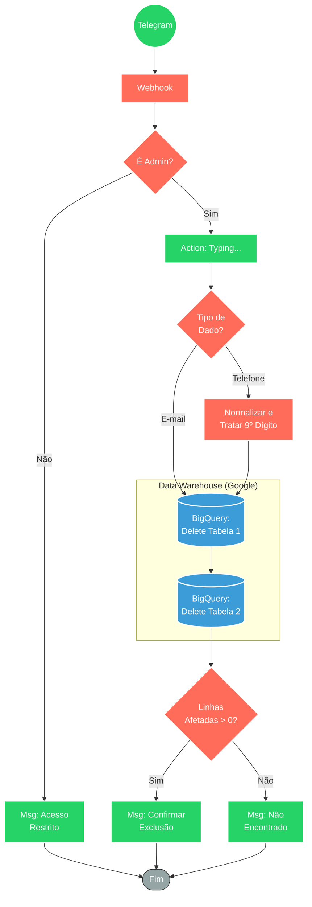

## ⚡ Bot de Exclusão de Dados BigQuery (LGPD)

#### 🧠 Lógica do Processo: Este fluxo atua como uma ferramenta administrativa de conformidade e limpeza de dados (LGPD) via Telegram. O sistema autentica o usuário (verificando se é um administrador autorizado) e processa solicitações de remoção de dados baseadas em **E-mail** ou **Telefone**. O fluxo normaliza os dados de entrada (incluindo tratamento inteligente de 9º dígito para celulares brasileiros) e executa comandos de exclusão (`DELETE`) sequencialmente em duas tabelas distintas do Google BigQuery. Ao final, o bot analisa o retorno do banco de dados e notifica o administrador, reportando especificamente se o contato foi encontrado e removido de cada plataforma.

---

### 🏗️ Diagrama de Arquitetura:

---

### 🔍 Dicionário de Dados

#### 1. Entrada e Segurança

* **Webhook Telegram** `(Nó: Webhook)`
* **Função:** Recebe o comando do administrador contendo o dado a ser excluído (texto da mensagem) e os metadados do remetente (Chat ID).

* **Validação de Admin** `(Nó: Usuário permitido?)`
* **Função:** Controle de Segurança. Compara o ID do remetente do Telegram contra uma lista fixa de IDs autorizados (Allowlist). Se não corresponder, o fluxo é encerrado imediatamente com um aviso de bloqueio.

#### 2. Processamento e Normalização

* **Roteador de Tipo** `(Nó: Switch)`
* **Função:** Classifica a entrada. Identifica se o texto enviado é um e-mail ou um número de telefone para aplicar o tratamento adequado.

* **Formatador de Telefone** `(Nó: Formata Telefone)`
* **Função:** Tratamento de Dados (Script JS).
* Remove caracteres não numéricos.
* Remove código do país (+55).
* **Lógica de Negócio:** Gera variações do número (com e sem o 9º dígito) para garantir que a exclusão no banco ocorra independente de como o dado foi cadastrado originalmente.

#### 3. Persistência e Exclusão (BigQuery)

* **Delete Tabela 1 / Tabela 2** `(Nós: Google BigQuery)`
* **Função:** Execução de Expurgo. Envia comandos SQL (`DELETE FROM ... WHERE ...`) para as tabelas de vendas/leads especificadas.
* **Entrada:** O dado normalizado (E-mail ou Telefone).
* **Saída:** Objeto contendo `numDmlAffectedRows` (número de linhas deletadas).

#### 4. Notificação de Status

* **Validador de Resultado** `(Nó: Encontrou?)`
* **Função:** Análise de Retorno. Verifica se o banco de dados retornou alguma linha afetada.

* **Bot de Resposta** `(Nós: Envia Msg)`
* **Função:** Feedback ao usuário. Envia mensagens distintas para cada plataforma:
* ✅ "Foi encontrado o contato em X linhas" (Sucesso).
* ❌ "Não foi encontrado o contato" (Falha).
