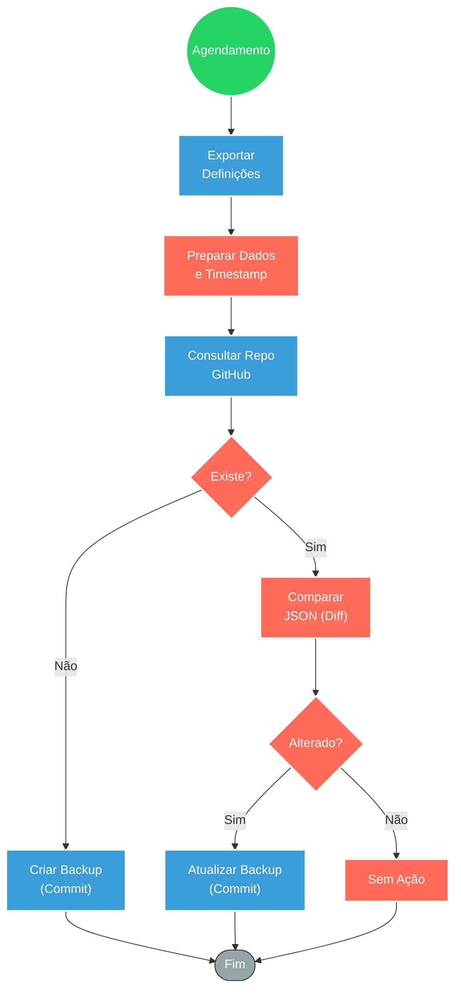

## ⚡ Sistema de Backup Versionado do RabbitMQ para GitHub

#### 🧠 Lógica do Processo: Este fluxo automatiza a segurança e governança das configurações do cluster RabbitMQ. Executado via agendamento semanal (segundas e quintas-feiras), o sistema extrai todas as definições da infraestrutura (filas, exchanges, bindings e usuários) diretamente da API administrativa do RabbitMQ. Antes de salvar, o fluxo consulta o repositório GitHub para verificar se já existe um backup para a data atual. Se o arquivo existir, um algoritmo de comparação ("diff") analisa se houve alterações reais na configuração desde a última execução, evitando commits redundantes. Caso seja detectada uma mudança ou o arquivo não exista, o n8n realiza o commit (criação ou atualização) no repositório, garantindo um histórico versionado da infraestrutura ("Infrastructure as Code").

---

### 🏗️ Diagrama de Arquitetura:

---

### 🔍 Dicionário de Dados

#### 1. Gatilho e Extração

* **Schedule Trigger** `(Nó: Schedule Trigger)`
* **Função:** Iniciador temporal. Configurado para executar rotinas de backup periodicamente (ex: Segundas e Quintas às 01:15), garantindo snapshots regulares da infraestrutura.

* **API RabbitMQ** `(Nó: RabbitMQ Backup)`
* **Função:** Fonte da Verdade. Realiza uma requisição HTTP GET autenticada ao endpoint `/api/definitions` do cluster RabbitMQ para obter o schema completo da mensageria em formato JSON.

#### 2. Lógica de Controle de Versão

* **GitHub Integration** `(Nós: Get / Create / Update Backup)`
* **Função:** Armazenamento Persistente. Interage com a API do GitHub para gerenciar os arquivos de backup.
* **Get:** Verifica existência prévia para evitar duplicidade ou erros de sobrescrita acidental.
* **Create/Update:** Realiza o commit do arquivo JSON no branch `main`, utilizando a data como identificador no nome do arquivo.

* **Comparador de Dados** `(Nó: Compare Backups)`
* **Função:** Inteligência de Deduplicação. Executa um script JavaScript que ordena as chaves dos objetos JSON (do backup atual e do anterior) e compara as strings resultantes. Isso assegura que apenas mudanças reais na configuração disparem uma atualização no repositório, economizando recursos e mantendo o histórico limpo.

#### 3. Tratamento de Erros e Fluxo

* **Verificadores Condicionais** `(Nós: Check If Exists / Check If Changed)`
* **Função:** Roteamento Lógico.
* **Check If Exists:** Decide se o fluxo deve criar um arquivo novo ou verificar um existente baseando-se no retorno de erro da consulta ao GitHub.
* **Check If Changed:** Decide se prossegue com o commit de atualização apenas se a variável `hasChanged` for verdadeira.

