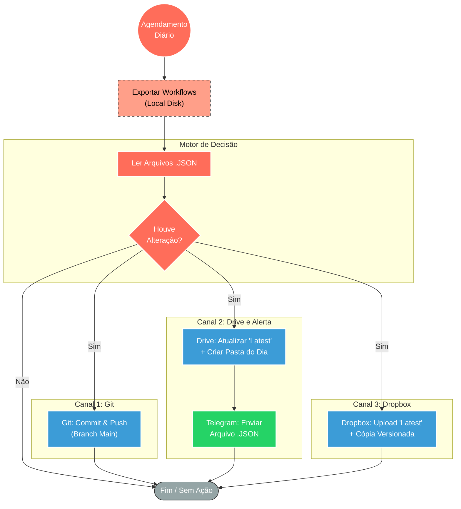

## ⚡ Sistema de Backup Multicanal e Versionamento de Workflows

#### 🧠 Lógica do Processo: Este ecossistema de automação garante a segurança, redundância e governança dos fluxos de trabalho do n8n. Atuando como uma estratégia de "Disaster Recovery", o sistema extrai periodicamente todos os workflows da instância local e os sincroniza com três ambientes distintos: **GitHub** (para versionamento de código e diffs), **Google Drive** e **Dropbox** (para armazenamento de arquivos e histórico diário). O diferencial inteligente reside no "Motor de Comparação": antes de realizar o upload ou commit, o sistema analisa os timestamps e o conteúdo dos arquivos (`updatedAt`). Se não houver alterações desde o último backup, a ação é ignorada, economizando recursos e mantendo o histórico limpo. Adicionalmente, o fluxo do Google Drive notifica o administrador via **Telegram** enviando o arquivo `.json` atualizado sempre que uma modificação é detectada.

---

### 🏗️ Diagrama de Arquitetura:

---

### 🔍 Dicionário de Dados

#### 1. Entrada e Extração

* **Agendamento e Gatilho Manual** `(Nós: Schedule Trigger / Manual)`
* **Função:** Inicia as rotinas de backup em horários estratégicos (ex: 01:15, 05:15) ou sob demanda.

* **Leitura Local** `(Nós: Read Binary Files / Execute Command)`
* **Função:** Acessa o sistema de arquivos do servidor onde o n8n está hospedado para capturar os dados brutos dos fluxos de trabalho.

#### 2. Lógica de Processamento

* **Processador de Arquivos** `(Nós: Code / ProcessaArquivo)`
* **Função:** Cérebro da operação.
* Extrai metadados (ID, Nome, Data de Atualização) dos arquivos binários.
* Sanitiza nomes de arquivos (remove caracteres especiais).
* Compara o `updatedAt` do arquivo local com a versão existente na nuvem (Drive/Dropbox/GitHub).
* Define a flag `deveAtualizar` para evitar duplicações desnecessárias.

#### 3. Integrações de Armazenamento

* **GitHub Integration** `(Nó: GitHub)`
* **Função:** Versionamento de Código (IaC).
* Mantém um histórico de commits.
* Permite visualizar o "diff" (o que mudou na lógica) através da interface do Git.

* **Google Drive** `(Nós: Google Drive / Cria pasta)`
* **Função:** Armazenamento em Nuvem Primário.
* Mantém uma pasta `Latest` com a versão mais recente.
* Cria pastas dinâmicas baseadas na data (`dd/MM/yyyy`) para histórico imutável.

* **Dropbox** `(Nós: Dropbox / Upload / Copy)`
* **Função:** Redundância Secundária.
* Segue lógica similar ao Drive, separando arquivos recentes de arquivos de histórico diário.

#### 4. Notificação e Alerta

* **Bot Telegram** `(Nó: Telegram)`
* **Função:** Auditoria em Tempo Real.
* Envia uma mensagem contendo o próprio arquivo `.json` do workflow sempre que uma alteração é detectada e salva no Google Drive, permitindo recuperação rápida via chat.

