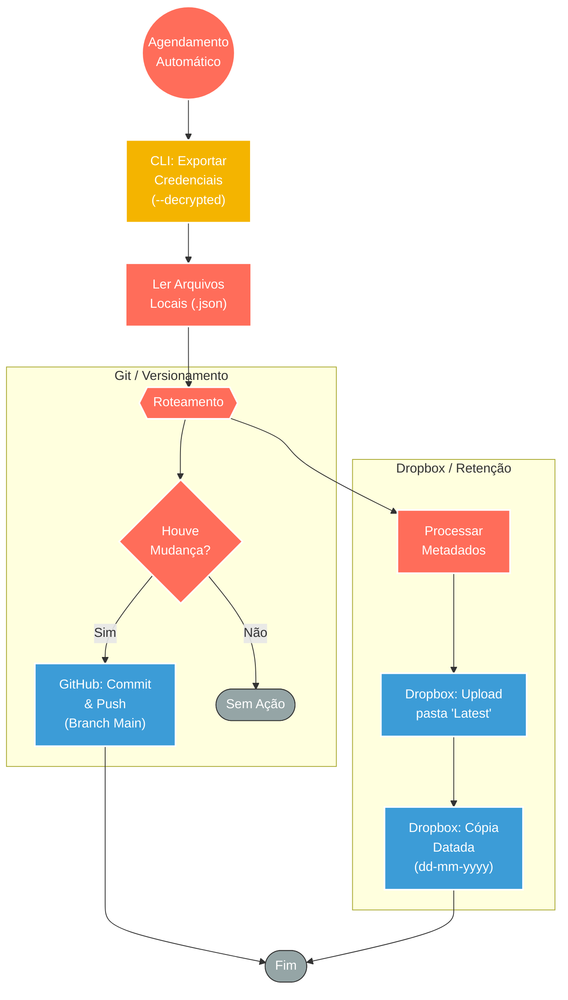

## ⚡ Sistema de Backup e Segurança de Credenciais (GitHub & Dropbox)

#### 🧠 Lógica do Processo: Este sistema é focado exclusivamente na segurança e portabilidade das credenciais de acesso do n8n. Operando através de agendamentos automáticos (madrugada), o fluxo executa comandos de sistema (CLI) para exportar as credenciais em formato descritografado (`--decrypted`), garantindo que possam ser restauradas ou migradas para outras instâncias sem dependência da chave de criptografia original. O processo implementa uma estratégia de "Backup Híbrido": sincroniza os arquivos JSON resultantes com um repositório privado no **GitHub** (para versionamento e auditoria de alterações) e realiza uploads para o **Dropbox** (mantendo uma cópia "Latest" e um histórico diário imutável). A inteligência do fluxo evita redundâncias comparando datas de modificação antes de efetivar o armazenamento.

---

### 🏗️ Diagrama de Arquitetura:

---

### 🔍 Dicionário de Dados

#### 1. Extração Segura de Dados

* **Comando de Exportação** `(Nó: Execute Command)`
* **Função:** Executa o comando `n8n export:credentials --decrypted --backup` diretamente no terminal do servidor.
* **Valor de Negócio:** Gera um backup legível e portável. O parâmetro `--decrypted` é crucial para recuperação de desastres, pois permite importar as chaves em uma nova instalação do n8n sem precisar da chave mestre da instância anterior.

#### 2. Processamento e Validação

* **Leitura Binária** `(Nó: Read Binary Files)`
* **Função:** Varre o diretório local capturando todos os arquivos gerados pela exportação.

* **Verificação de Integridade** `(Nó: ProcessaArquivo)`
* **Função:** Analisa o arquivo JSON antes do upload para o Dropbox, verificando se houve erros na leitura ou se o arquivo é idêntico ao backup anterior, otimizando o uso de armazenamento e API.

#### 3. Canais de Armazenamento

* **GitHub (Versionamento)** `(Nó: GitHub)`
* **Função:** Repositório de Segurança. Armazena as credenciais como código.
* **Ação:** Realiza um *Commit* apenas se houver diferença entre o arquivo local e o remoto, criando um log de auditoria de quem alterou qual credencial e quando.

* **Dropbox (Arquivamento)** `(Nós: UploadLatest / CopyVersaoDiaria)`
* **Função:** Redundância Temporal.
* **Pasta Latest:** Contém sempre a versão mais atual para restauração rápida (Hot Storage).
* **Pasta Datada:** Cria uma cópia em `credentials/dd-MM-yyyy/` para histórico de longo prazo (Cold Storage).
