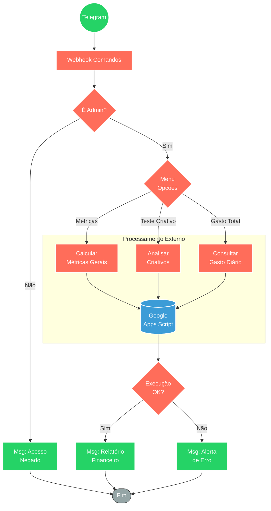

## ⚡ Bot Telegram para Monitoramento de Métricas de Anúncios (Meta Ads)

#### 🧠 Lógica do Processo: Este fluxo opera como um assistente pessoal de Business Intelligence (BI) integrado ao Telegram. Ele permite que gestores de tráfego consultem, em tempo real, o desempenho de campanhas publicitárias (Facebook/Meta Ads). Ao receber um comando, o sistema primeiro autentica o usuário verificando seu ID contra uma lista de administradores permitidos. Após a validação, um menu interativo roteia a solicitação para três funções principais executadas externamente via Google Apps Script: (1) Cálculo completo de métricas, (2) Análise de testes de criativos e (3) Consulta rápida de gasto diário. O bot gerencia o feedback visual ("digitando...") enquanto aguarda o processamento e retorna os relatórios financeiros ou alertas de erro diretamente no chat.

---

### 🏗️ Diagrama de Arquitetura:

---

### 🔍 Dicionário de Dados

#### 1. Entrada e Segurança

* **Webhook Telegram** `(Nó: Webhook)`
* **Função:** Interface de comando. Recebe mensagens de texto ou cliques em botões do menu interativo do Telegram.

* **Controle de Acesso** `(Nó: Usuário permitido?)`
* **Função:** Firewall de Aplicação. Verifica se o `User ID` do remetente está na lista de IDs autorizados. Bloqueia requisições não autorizadas para proteger dados sensíveis de custos e performance.

#### 2. Orquestração e Roteamento

* **Gerenciador de Menu** `(Nó: Switch)`
* **Função:** Roteador de Intenções. Direciona o fluxo baseando-se no texto da mensagem recebida:
* **"Métricas":** Aciona a atualização completa dos dashboards.
* **"Teste criativo":** Foca na análise específica de novos anúncios.
* **"Gasto total":** Retorna apenas o valor monetário investido no dia (`gastoTotal`).

#### 3. Integração e Cálculo (Backend)

* **Motor de Cálculo Google** `(Nós: HTTP Request)`
* **Função:** Processamento de Dados (ETL). Realiza chamadas GET para Web Apps publicados no Google Apps Script.
* **Papel:** O n8n atua como gatilho, enquanto o Google Sheets/Script executa a lógica pesada de conexão com a API do Meta Ads e consolidação dos dados.
* **Parâmetros:** Envia o tipo de ação (`acao=calcular`, `acao=teste_criativo`, `acao=gasto_meta_ads`).

#### 4. Comunicação e Feedback

* **Bot de Resposta** `(Nós: Envia Msg)`
* **Função:** Interface de Usuário.
* **Feedback de Estado:** Envia ações de "Chat Action: Typing" para indicar que o bot está processando (evita sensação de travamento).
* **Entrega de Valor:** Formata o JSON de resposta do Google Script em mensagens legíveis (ex: "✅ Gasto total hoje R$ 150,00") ou notifica falhas na execução do script.
