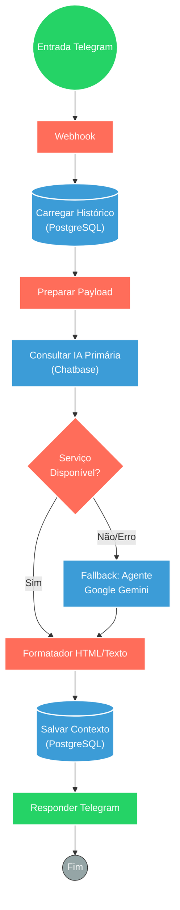

## ⚡ Orquestrador de IA Híbrida (Chatbase + Gemini)

#### 🧠 Lógica do Processo: Este workflow atua como um gateway de atendimento inteligente e resiliente para o Telegram. O objetivo principal é fornecer respostas baseadas em uma base de conhecimento personalizada (Chatbase). No entanto, o sistema implementa um padrão de "Failover Inteligente": caso o Chatbase esteja indisponível ou sobrecarregado, o fluxo automaticamente aciona um agente secundário baseado no **Google Gemini**, garantindo que o usuário nunca fique sem resposta. Todo o contexto da conversa é persistido em um banco **PostgreSQL**, permitindo continuidade no diálogo. As respostas são higienizadas (conversão de Markdown para HTML) antes do envio final ao usuário.

---

### 🏗️ Diagrama de Arquitetura:

---

### 🔍 Dicionário de Dados

#### 1. Entrada e Contexto

* **Webhook Telegram** `(Nó: Webhook)`
* **Função:** Recebe as mensagens de texto dos usuários em tempo real.

* **Memória PostgreSQL** `(Nós: Postgres Chat Memory / Manager)`
* **Função:** Gestão de Estado (State Management). Armazena e recupera o histórico de mensagens (User + AI) usando uma chave de sessão baseada no ID do usuário, permitindo conversas longas e contextuais.

#### 2. Motores de Inteligência Artificial

* **Chatbase API** `(Nó: HTTP Request / Chatbase)`
* **Função:** IA Primária (RAG). Consulta uma base de conhecimento treinada especificamente com dados do negócio para gerar a resposta ideal.

* **Google Gemini** `(Nó: Google Gemini Chat Model)`
* **Função:** IA de Fallback (Resiliência). Entra em ação apenas se a IA primária falhar, garantindo continuidade do serviço com um modelo de linguagem generalista.

* **Agente de IA** `(Nó: AI Agent)`
* **Função:** Executor de Regras. Gerencia o prompt do sistema e a interação com o modelo Gemini quando o fallback é acionado.

#### 3. Tratamento e Saída

* **Formatador de Texto** `(Nó: Formata texto1)`
* **Função:** Middleware de Apresentação. Converte formatação Markdown (comum em LLMs) para tags HTML suportadas pelo Telegram (negrito, listas, quebras de linha), melhorando a legibilidade.

