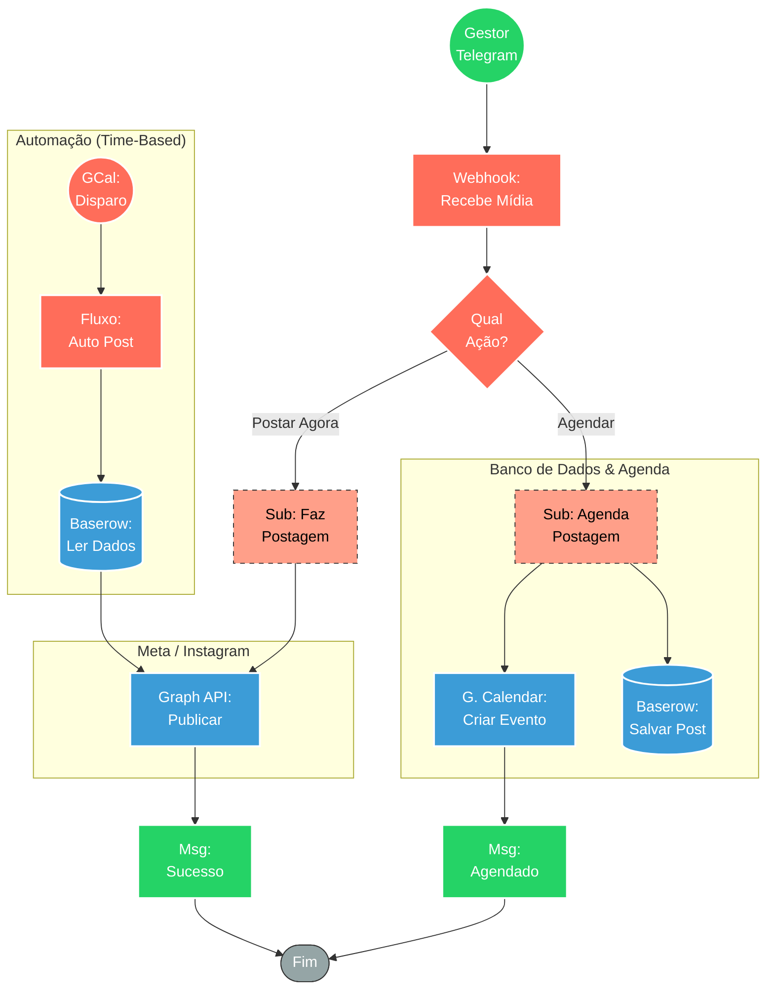

## ⚡ Sistema de Agendamento e Publicação Instagram via Telegram

#### 🧠 Lógica do Processo: Este ecossistema de automação transforma o Telegram em um CMS ágil para redes sociais. O fluxo central (`PostGram`) atua como controlador: recebe imagens e legendas do usuário e oferece um menu para **Publicação Imediata** ou **Agendamento**.
* **Agendamento:** O subfluxo persiste o conteúdo no **Baserow** e cria um evento no **Google Calendar**.
* **Execução Automática:** Um gatilho monitora o Google Calendar; ao iniciar o evento, recupera os dados do banco e executa a postagem.
* **Publicação Imediata:** O sistema aciona diretamente a API da Meta para postagem instantânea.

---

### 🏗️ Diagrama de Arquitetura:

---

### 🔍 Dicionário de Dados

#### 1. Interface e Controle (Frontend)

* **Bot Telegram (PostGram)** `(Nó: Webhook / Switch)`
* **Função:** Interface de entrada. Captura a imagem e o texto da legenda enviados pelo usuário e gerencia o menu de decisão.
* **Entrada:** Arquivo de imagem + Texto (Caption).

#### 2. Armazenamento e Agendamento (Backend)

* **Baserow** `(Nó: Baserow)`
* **Função:** Headless CMS. Armazena a URL da imagem e a legenda para recuperação futura.

* **Google Calendar** `(Nó: Google Calendar Trigger / Create)`
* **Função:** Motor de Cronograma.
* **Create:** Agenda a publicação criando um evento.
* **Trigger:** Aciona o fluxo de publicação automaticamente na hora marcada.

#### 3. Execução e Publicação

* **Meta Graph API** `(Nó: HTTP Request)`
* **Função:** Publicador. Conecta-se aos endpoints do Instagram Business para:
1. Criar container de mídia.
2. Efetivar a publicação da foto/carrossel.

* **Saída:** ID da publicação gerada.

#### 4. Sub-Workflows

* **Sub: Agenda Postagem** `(Agenda Postagem.json)`
* **Função:** Lógica de persistência (DB) e agendamento (Calendar).

* **Sub: Faz Postagem** `(Faz Postagem.json)`
* **Função:** Lógica técnica de envio para a API da Meta.

