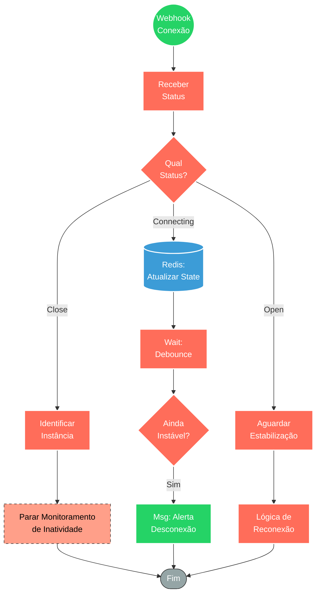

## ⚡ Monitor de Status de Conexão WhatsApp API

#### 🧠 Lógica do Processo: Este workflow atua como um "Watchdog" (Cão de Guarda) para a infraestrutura de mensageria. Ele escuta passivamente eventos de mudança de estado da conexão via Webhook. Ao receber um status, o sistema classifica o evento:
* **Conectado (Open):** Estabiliza a conexão e confirma a operabilidade.
* **Conectando (Connecting):** Atualiza o estado em memória (Redis) para rastreamento.
* **Desconectado (Close):** Ação crítica. O fluxo identifica qual instância caiu, interrompe imediatamente processos de "verificação de inatividade" (para evitar erros em cascata) e, após uma validação de persistência (debounce via Redis e Wait), envia um alerta urgente via Telegram para o administrador, informando que o número está offline.

---

### 🏗️ Diagrama de Arquitetura:

---

### 🔍 Dicionário de Dados

#### 1. Monitoramento e Entrada

* **Webhook de Conexão** `(Nó: Webhook)`
* **Função:** Listener de eventos. Recebe o payload JSON do Gateway de WhatsApp sempre que o status da sessão muda (open, close, connecting, qr, etc).
* **Dados Chave:** `instance` (nome da sessão), `state` (status atual).

#### 2. Gestão de Estado e Decisão

* **Roteador de Status** `(Nó: Switch)`
* **Função:** Classificador de Eventos. Separa o tráfego baseado no valor do campo de estado da conexão.

* **Controle de Estado Redis** `(Nós: Redis)`
* **Função:** Memória de Curto Prazo.
* Armazena o último status conhecido para evitar "flapping" (notificações repetidas se a conexão ficar oscilando rapidamente entre conectar/desconectar).

* **Verificador de Persistência** `(Nós: Wait / If)`
* **Função:** Debounce Lógico. Aguarda um tempo (ex: 1 minuto) após um sinal de instabilidade para verificar se a conexão voltou sozinha antes de incomodar o administrador com um alerta.

#### 3. Ações de Governança

* **Gerenciador de Processos** `(Nó: n8n - Execute Workflow)`
* **Função:** Controle de Danos. Executa o comando `Parar verificação de inatividade`.
* **Porquê:** Se o WhatsApp está desconectado, fluxos que dependem dele para verificar inatividade de clientes vão falhar. Este nó "desliga" esses fluxos auxiliares preventivamente.

* **Notificação de Emergência** `(Nó: Telegram Envia Msg)`
* **Função:** Alerta Crítico. Envia mensagem direta para o suporte técnico informando exatamente qual linha caiu, permitindo ação rápida para re-scanear o QR Code.

