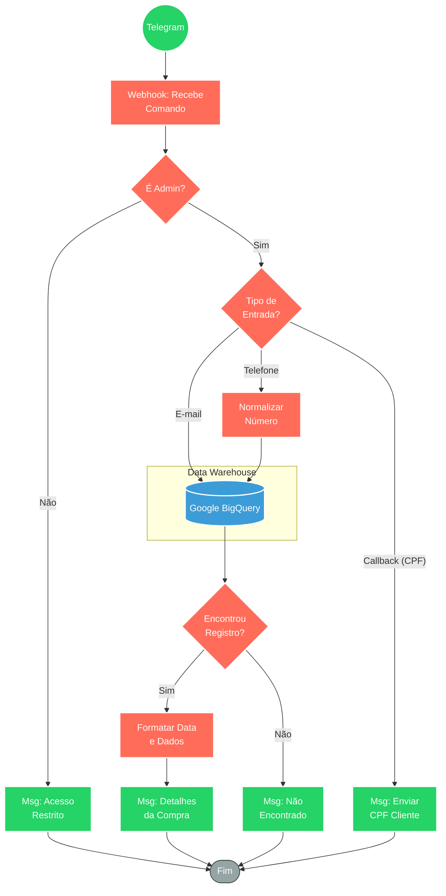

## ⚡ Bot de Consulta de Clientes BigQuery

#### 🧠 Lógica do Processo: Este fluxo atua como uma ferramenta de Business Intelligence (BI) via Telegram, permitindo que administradores consultem bases de dados de vendas hospedadas no Google BigQuery. O sistema autentica o usuário e aceita entradas via texto (E-mail ou Telefone) ou interações de botão. Para consultas telefônicas, há uma etapa de normalização inteligente que gera variações do número para garantir a localização do registro. O bot retorna os detalhes da compra (Data, Nome, Produto) e oferece fluxos interativos para solicitar dados sensíveis adicionais, como CPF, sob demanda.

---

### 🏗️ Diagrama de Arquitetura:

---

### 🔍 Dicionário de Dados

#### 1. Interface e Segurança

* **Webhook Telegram** `(Nó: Webhook)`
* **Função:** Ponto de entrada. Captura mensagens de texto para busca ou cliques em botões (Callbacks) para ações secundárias.

* **Controle de Acesso** `(Nó: If6)`
* **Função:** Segurança. Valida se o ID do usuário do Telegram está presente na lista de administradores autorizados (Whitelist).

#### 2. Processamento de Dados

* **Normalizador de Telefone** `(Nó: Formata Telefone)`
* **Função:** Tratamento de Dados (Script JS). Cria múltiplas variações do número recebido (ex: com +55, apenas DDD, com 9 dígitos, sem 9 dígitos) para aumentar a taxa de sucesso da busca SQL (`LIKE` ou `RegExp`).

* **Formatador de Resposta** `(Nós: Envia Msg - Detalhes)`
* **Função:** Apresentação. Converte datas brutas do banco para o formato brasileiro (`DD/MM/YY`) e estrutura o layout da mensagem com Nome, Email, Produto e Telefone.

#### 3. Integração com Banco de Dados

* **Google BigQuery**
* **Função:** Motor de Busca. Executa queries SQL complexas nas tabelas.
* **Entrada:** String de busca (E-mail ou variações de Telefone).
* **Saída:** Linhas correspondentes contendo os dados transacionais do cliente.

#### 4. Interatividade

* **Botão de Ação** `(Nó: Envia Msg com Botão)`
* **Função:** UX/UI. Caso o administrador precise do CPF, o bot oferece um botão "Sim" que dispara um callback para recuperar esse dado específico, evitando expor dados sensíveis desnecessariamente na primeira mensagem.

