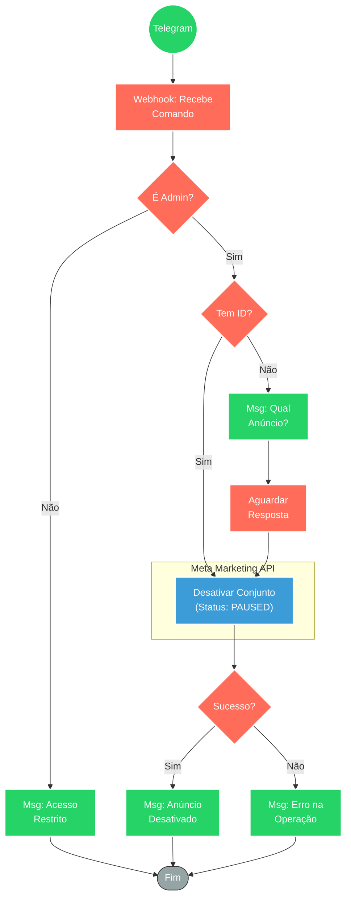

## ⚡ Sistema de Desativação de Anúncios Facebook Ads via Telegram

#### 🧠 Lógica do Processo: Este fluxo funciona como um controle remoto de emergência para gestores de tráfego. Ele permite pausar conjuntos de anúncios (Ad Sets) no Meta Ads diretamente pelo Telegram, sem precisar acessar o Gerenciador de Negócios. O sistema inicia autenticando o usuário (verificando se é um administrador autorizado). Se validado, o bot identifica se o ID do anúncio foi fornecido ou solicita essa informação. Em seguida, executa uma requisição à API do Facebook para alterar o status do conjunto para "PAUSED". Por fim, analisa a resposta da API e notifica o gestor sobre o sucesso da operação ou reporta erros, garantindo controle rápido sobre gastos ou campanhas problemáticas.

---

### 🏗️ Diagrama de Arquitetura:

---

### 🔍 Dicionário de Dados

#### 1. Interface e Segurança

* **Webhook Telegram** `(Nó: Webhook)`
* **Função:** Gatilho de Entrada. Recebe comandos do administrador para iniciar o processo de pausa de campanhas.

* **Validação de Permissão** `(Nó: Usuário permitido?)`
* **Função:** Controle de Acesso (ACL). Verifica o `Chat ID` ou `User ID` do remetente contra uma lista de usuários confiáveis para impedir que pessoas não autorizadas alterem campanhas.

#### 2. Lógica de Negócio

* **Verificação de Input** `(Nó: conversa ou id?)`
* **Função:** Tratamento de Entrada. Identifica se o usuário já enviou o ID do conjunto de anúncios no comando inicial ou se é necessário iniciar um diálogo interativo para solicitar essa informação.

* **Interação de Diálogo** `(Nó: Envia Msg - Qual anuncio?)`
* **Função:** Coleta de Dados. Solicita ao usuário o identificador do ativo que deve ser pausado, caso não tenha sido informado.

#### 3. Integração Externa

* **API Meta Ads** `(Nó: Desativa anuncio facebook)`
* **Função:** Execução de Comando. Realiza uma chamada HTTP (POST/UPDATE) para a Graph API do Facebook, direcionada ao endpoint do `AdSet ID` especificado, alterando o campo `status` para `PAUSED`.
* **Entrada:** ID do Conjunto de Anúncios.
* **Saída:** Confirmação de atualização (bool) ou mensagem de erro da API.

#### 4. Feedback e Notificação

* **Validador de Resposta** `(Nó: Desativou?)`
* **Função:** Tratamento de Erro. Analisa o JSON retornado pela Meta para determinar se a ação foi efetivada.

* **Bot de Resposta** `(Nós: Envia Msg)`
* **Função:** Feedback Operacional. Informa o resultado final:
* ✅ "Anúncio desativado com sucesso".
* ❌ "Não foi possível desativar" (geralmente acompanhado do motivo, ex: ID inválido ou erro de permissão).
