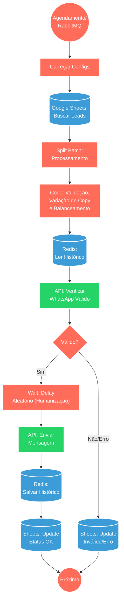

## ⚡ Sistema de Disparo Otimizado com Humanização (WhatsApp)

#### 🧠 Lógica do Processo: Este workflow é um motor robusto para campanhas de marketing via WhatsApp, focado em alta entregabilidade e segurança contra bloqueios. O processo inicia via agendamento ou fila (RabbitMQ), buscando uma lista de leads no Google Sheets. A inteligência central reside na distribuição de carga: o sistema valida se o número possui WhatsApp ativo, rotaciona entre múltiplas instâncias de envio (balanceamento de carga) e altera dinamicamente o texto da mensagem (Variação de Copy) baseando-se no histórico salvo no Redis para evitar repetições. Antes do envio, aplica um delay aleatório (humanização) para simular comportamento real. O status final (Enviado, Inválido ou Erro) é gravado de volta na planilha para relatórios.

---

### 🏗️ Diagrama de Arquitetura:

---

### 🔍 Dicionário de Dados

#### 1. Entrada e Gatilhos

* **RabbitMQ / Schedule** `(Nós: RabbitMQ Trigger / Schedule Trigger)`
* **Função:** Iniciadores do processo. Permite que o disparo ocorra em horário fixo ou via mensagem em fila para escalabilidade horizontal.

* **Google Sheets (Leitura)** `(Nó: Buscar Leads)`
* **Função:** Fonte de Dados. Recupera os contatos a serem processados, filtrando apenas aqueles que ainda não receberam mensagem ("Enviado" vazio ou pendente).

#### 2. Processamento Inteligente

* **Motor de Decisão (Code)** `(Nó: Code1)`
* **Função:** Cérebro da Operação.
* **Normalização:** Trata números de telefone (DDI+DDD+Número).
* **Load Balance:** Alterna o envio entre diferentes instâncias conectadas.
* **Anti-Spam:** Seleciona variações de texto (A/B testing) e verifica no Redis qual foi a última mensagem enviada para aquele número, evitando repetições.

* **Memória Redis** `(Nós: Redis_Get / Redis)`
* **Função:** Cache de Contexto. Armazena o histórico de variações de mensagens enviadas por número, garantindo rotação de conteúdo e evitando comportamento robótico.

#### 3. Execução e Saída

* **Gateway WhatsApp** `(Nós: Whatsapp válido? / Envia mensagem)`
* **Função:** Interface de Comunicação.
* Primeiro valida se o número existe no WhatsApp (economiza custos e evita banimento).
* Realiza o disparo efetivo da mensagem com delay simulado.

* **Google Sheets (Escrita)** `(Nós: ATUALIZAR / Erro1 / Atualizar Planilha)`
* **Função:** Log de Auditoria. Registra o resultado de cada tentativa (Enviado, WhatsApp Inválido, Erro) e a data/hora do processamento, permitindo gestão visual do progresso.

