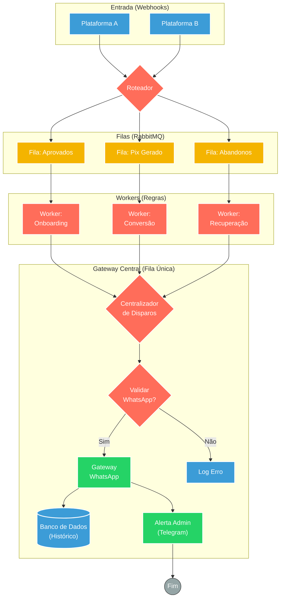

## ⚡ Orquestrador de Ciclo de Vendas e Onboarding (Multi-Plataformas)

#### 🧠 Lógica do Processo: Este ecossistema atua como um hub central de processamento de pedidos para infoprodutos. O sistema ingere webhooks de vendas e classifica os eventos em filas de alta disponibilidade no **RabbitMQ**. Workers dedicados processam cada estágio do funil: (1) **Onboarding** (vendas aprovadas), (2) **Conversão** (pix gerado) e (3) **Recuperação** (carrinho abandonado). O diferencial desta arquitetura é o **Gateway Central de Saída** ("Fila Única"): todos os workers encaminham as mensagens prontas para este fluxo final, que realiza a validação do número, o disparo sequencial via WhatsApp e o log de auditoria, evitando conflitos e banimentos por excesso de requisições simultâneas.

---

### 🏗️ Diagrama de Arquitetura:

---

### 🔍 Dicionário de Dados

#### 1. Ingestão e Buffering

* **RabbitMQ Triggers** `(Nós: RabbitMQ Trigger)`
* **Função:** Gerenciamento de Carga. Recebe eventos brutos das vendas. O uso de filas garante que o sistema suporte grandes volumes (ex: lançamentos) sem perder dados, processando cada pedido no seu tempo.

#### 2. Workers (Processamento Especializado)

* **Worker Aprovado** 
* **Função:** Entrega. Prepara a mensagem de boas-vindas e libera o acesso ao produto.

* **Worker Pix** 
* **Função:** Cobrança. Formata o código "Copia e Cola" e agenda lembretes de vencimento.

* **Worker Abandono** 
* **Função:** Resgate. Filtra leads qualificados e inicia régua de recuperação de venda.

#### 3. Gateway de Saída (Fila Única)

* **Consumidor Central** `(Fluxo: Fila unica consumindo)`
* **Função:** Funil de Disparo. Este é o único ponto do sistema que se comunica com a API externa de mensagens.
* **Benefício:** Centraliza a lógica de validação de números, controle de *throttle* (velocidade de envio) e tratamento de erros.

* **API de Mensagens** `(Nó: Whatsapp envio)`
* **Função:** Comunicação. Envia o texto/mídia final para o cliente.

* **Log e Auditoria** `(Nós: Aviso Telegram / Insere DB)`
* **Função:** Observabilidade. Salva o status de cada tentativa (Sucesso/Falha) no banco e notifica a equipe administrativa sobre anomalias ou vendas confirmadas em tempo real.

