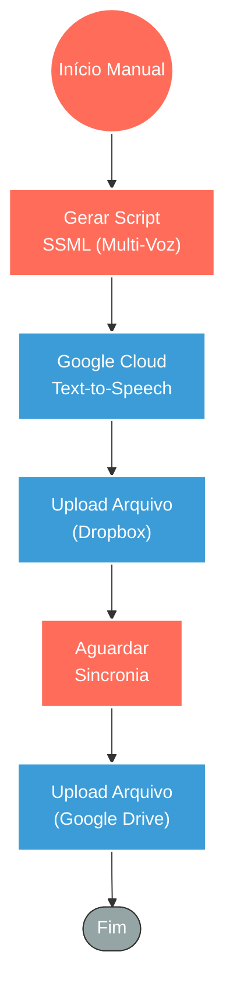

## ⚡ Gerador de Podcast Automático via Google TTS (SSML)

#### 🧠 Lógica do Processo: Este workflow automatiza a produção de áudios narrativos complexos (estilo podcast) utilizando inteligência artificial. O processo inicia-se com a construção dinâmica de um script em formato **SSML** (Speech Synthesis Markup Language) via código, permitindo a alternância entre diferentes vozes (ex: Locutor A e B), controle de prosódia (velocidade/tom), inserção de pausas dramáticas e até trilha sonora de fundo. Esse script estruturado é enviado para a API do **Google Cloud Text-to-Speech**, que sintetiza o conteúdo em um arquivo de áudio de alta fidelidade (MP3). Para finalizar, o sistema realiza o upload automático do arquivo gerado para serviços de armazenamento em nuvem (**Dropbox** e **Google Drive**), garantindo backup e facilidade de distribuição.

---

### 🏗️ Diagrama de Arquitetura:

---

### 🔍 Dicionário de Dados

#### 1. Criação e Síntese de Áudio

* **Gerador de Roteiro SSML** `(Nó: Code)`
* **Função:** Roteirista Digital. Utiliza JavaScript para montar uma string XML complexa que instrui a IA sobre *como* falar. Define a troca de personagens (`<voice name='pt-BR-Standard-A'>`), ajustes de entonação (`<prosody>`) e insere elementos de áudio externos (`<audio src>`).

* **Sintetizador de Voz** `(Nó: Google Cloud Text-to-Speech)`
* **Função:** Motor de IA. Recebe o payload SSML e o transforma em dados binários de áudio (MP3), aplicando as configurações de codificação e idioma solicitadas.

#### 2. Armazenamento e Persistência

* **Armazenamento Dropbox** `(Nó: Dropbox)`
* **Função:** Backup Primário. Recebe o arquivo binário gerado e o salva em um diretório específico (ex: `/test_audio.mp3`) para acesso rápido.

* **Armazenamento Google Drive** `(Nó: Google Drive)`
* **Função:** Backup Secundário/Compartilhamento. Realiza o upload redundante do mesmo arquivo para o Google Drive, garantindo disponibilidade em múltiplos ecossistemas.

#### 3. Controle de Fluxo

* **Temporizador** `(Nó: Wait)`
* **Função:** Estabilidade. Introduz uma pausa técnica (1 segundo) entre as operações de upload para evitar conflitos de leitura/escrita ou rate-limits em operações sequenciais rápidas.
