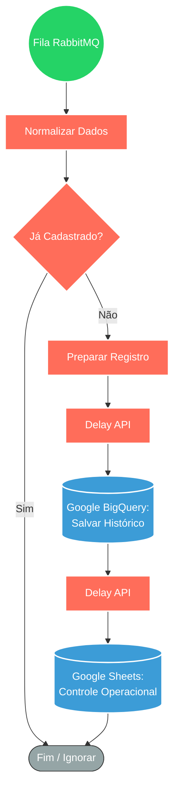

## ⚡ Sistema de Cadastro e Governança de Leads

#### 🧠 Lógica do Processo: Este workflow atua como um "Processador de Entrada" dedicado a oficializar novos usuários que solicitam o teste gratuito de um produto. Ele consome mensagens da fila **RabbitMQ** para garantir que nenhum pedido seja perdido. A inteligência do fluxo está na **Validação de Unicidade**: ele verifica se o lead já existe na base para impedir duplicidade de cadastro. Uma vez validado, o sistema orquestra a distribuição dos dados para dois destinos estratégicos: o **Google BigQuery** (para inteligência de dados e histórico) e o **Google Sheets** (para controle operacional da equipe), utilizando pausas inteligentes para respeitar os limites das APIs.

---

### 🏗️ Diagrama de Arquitetura:

---

### 🔍 Dicionário de Dados

#### 1. Recebimento e Fila

* **RabbitMQ Trigger** `(Nó: RabbitMQ Trigger1)`
* **Função:** Entrada Assíncrona. Recebe as solicitações de novos testes grátis via fila. Isso separa o atendimento (bot/site) do processamento pesado, garantindo fluidez mesmo com alto volume de inscrições.

#### 2. Qualidade e Validação

* **Normalizador** `(Nó: Code)`
* **Função:** Padronização. Limpa e formata os dados brutos (ex: ajusta telefones, padroniza e-mails) para garantir que o cadastro seja feito corretamente.

* **Verificador de Duplicidade** `(Nós: consulta / If2)`
* **Função:** Filtro de Segurança. Consulta o banco de dados antes de registrar. Se o usuário já tiver cadastro, o fluxo encerra a execução, mantendo a base de dados limpa e sem repetidos.

#### 3. Registro e Armazenamento

* **Google BigQuery** `(Nó: Google BigQuery)`
* **Função:** Base Analítica. Grava o lead no Data Warehouse para relatórios de longo prazo e inteligência de negócio.

* **Google Sheets** `(Nó: Google Sheets)`
* **Função:** Controle Diário. Cria uma cópia do registro em uma planilha de fácil acesso, permitindo que a equipe de vendas ou suporte visualize os novos inscritos em tempo real.
