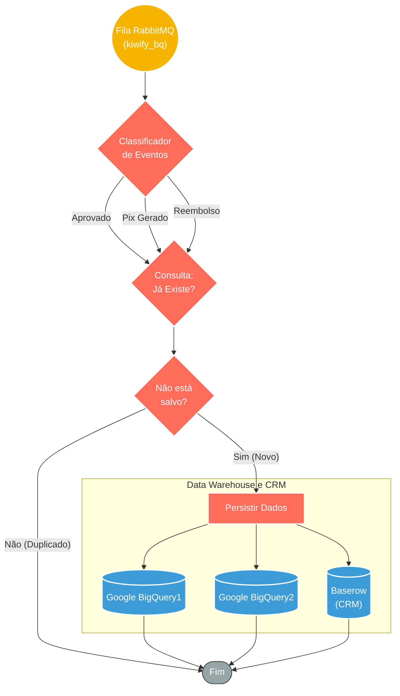

## ⚡ Pipeline de Integração Kiwify (BigQuery & Baserow)

#### 🧠 Lógica do Processo: Este workflow atua como um pipeline de engenharia de dados, responsável pela ingestão e persistência de eventos de vendas da Kiwify. O processo inicia consumindo uma fila dedicada no **RabbitMQ** (`kiwify_bq`), garantindo o desacoplamento e processamento assíncrono. Os eventos são triados por tipo (Aprovado, Pix Gerado, Reembolso) e passam por uma verificação de duplicidade para garantir a integridade da base. Caso o registro seja inédito ou necessite atualização, o sistema distribui os dados para dois destinos: **Google BigQuery** (para armazenamento histórico e BI) e **Baserow** (para gestão operacional de contatos), consolidando uma visão unificada dos clientes.

---

### 🏗️ Diagrama de Arquitetura:

---

### 🔍 Dicionário de Dados

#### 1. Ingestão e Controle

* **RabbitMQ Trigger** `(Nó: RabbitMQ Trigger)`
* **Função:** Ingestão de Dados. Consome mensagens da fila `kiwify_bq`, assegurando que todos os eventos de vendas (webhook) sejam capturados e processados sequencialmente, sem perda de dados em momentos de pico.

#### 2. Triagem e Qualidade

* **Classificador de Eventos** `(Nós: Switch / aprovado / pix gerado)`
* **Função:** Roteamento Lógico. Identifica a natureza da transação (Venda Aprovada, Pix Pendente ou Reembolso) para direcionar o tratamento adequado dos dados.

* **Verificador de Duplicidade** `(Nós: consulta se já existe / Não está salvo?)`
* **Função:** Deduplicação. Consulta a base de dados existente para verificar se o cliente ou pedido já foi registrado. Se o registro já existir, o fluxo evita a criação de linhas duplicadas, mantendo a integridade do Data Warehouse.

#### 3. Armazenamento (Data Warehouse)

* **Google BigQuery**
* **Função:** Armazenamento Analítico. Grava os detalhes da transação em tabelas específicas do BigQuery. Isso permite a criação de dashboards financeiros complexos e análises de LTV (Lifetime Value) posteriormente.

* **Baserow** `(Contexto do Fluxo)`
* **Função:** Banco de Dados Operacional. Atua como um CRM leve, permitindo que a equipe visualize e gerencie os contatos processados de forma amigável.

