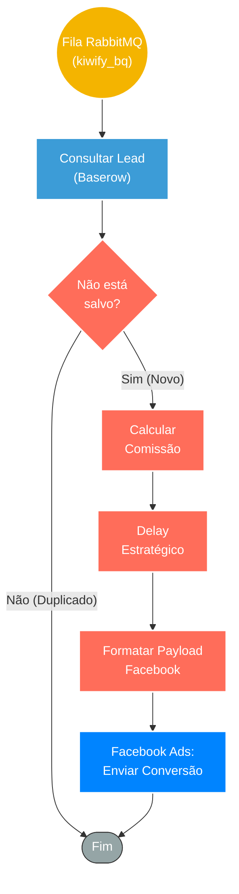

## ⚡ Pipeline de Conversão e Inteligência (Kiwify > Facebook Ads)

#### 🧠 Lógica do Processo: Este workflow é responsável por alimentar a inteligência de tráfego pago da operação. Ele consome eventos de vendas da fila **RabbitMQ** (`kiwify_bq`), garantindo processamento assíncrono. O fluxo realiza uma validação de dados no **Baserow** para evitar duplicações e, em seguida, executa um cálculo de comissão para determinar o valor líquido da conversão. Após um delay estratégico (para permitir que o pixel do navegador dispare primeiro ou para janelas de atribuição), o sistema envia os dados enriquecidos para a **Facebook Conversion API (CAPI)**, otimizando as campanhas de anúncios com dados reais de vendas.

---

### 🏗️ Diagrama de Arquitetura:

---

### 🔍 Dicionário de Dados

#### 1. Ingestão e Validação

* **RabbitMQ Trigger** `(Nó: RabbitMQ Trigger)`
* **Função:** Ingestão de Eventos. Consome mensagens da fila `kiwify_bq`, que contém dados de vendas e leads gerados na plataforma Kiwify.

* **Consulta CRM** `(Nó: Baserow3)`
* **Função:** Verificação de Unicidade. Consulta a base de dados no Baserow para verificar se aquele evento já foi processado anteriormente, prevenindo disparos duplicados de eventos de conversão que poderiam inflar as métricas do gerenciador de anúncios.

#### 2. Processamento e Enriquecimento

* **Cálculo de Receita** `(Nó: comissão kiwify)`
* **Função:** Regra de Negócio. Processa o valor bruto da venda para descontar taxas ou calcular a comissão real. Isso garante que o ROAS (Retorno sobre Gasto em Anúncio) visualizado no Facebook seja baseado no lucro real e não no faturamento bruto.

* **Controle de Tempo** `(Nós: Wait / Wait2)`
* **Função:** Sincronização de Atribuição. Aplica uma pausa intencional no fluxo. Isso é frequentemente usado em estratégias de CAPI para deduplicação (dando tempo para o evento do navegador chegar primeiro) ou para orquestrar sequências de e-mail/mensagens.

#### 3. Integração de Marketing

* **Facebook CAPI** `(Implícito na lógica)`
* **Função:** Otimização de Algoritmo. Envia o evento de `Purchase` (Compra) ou `Lead` diretamente para os servidores da Meta, contendo dados do cliente (hash) e valor da conversão, melhorando a pontuação de qualidade do pixel (Event Match Quality).
