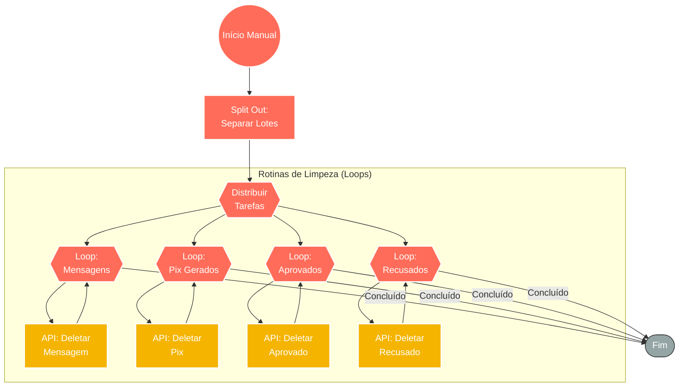

## ⚡ Sistema de Manutenção e Limpeza de Banco de Dados (Kiwify)

#### 🧠 Lógica do Processo: Este workflow atua como um **Garbage Collector** (Coletor de Lixo) automatizado para a infraestrutura de dados da operação. Acionado manualmente para manutenções periódicas, o sistema tem como objetivo higienizar o banco de dados (NocodeDB) removendo registros processados ou obsoletos para otimizar custos e performance. O fluxo processa listas de IDs e orquestra loops de deleção paralelos para quatro entidades críticas: **Mensagens enviadas**, **Pix gerados**, **Vendas Aprovadas** e **Vendas Recusadas**. Essa rotina previne o "inchaço" (bloat) do banco, garantindo que as tabelas ativas contenham apenas dados relevantes para a operação atual.

---

### 🏗️ Diagrama de Arquitetura:

---

### 🔍 Dicionário de Dados

#### 1. Controle e Preparação

* **Gatilho Manual** `(Nó: Manual Trigger)`
* **Função:** Start sob Demanda. Permite que o administrador execute a limpeza em horários controlados (ex: madrugadas) para não impactar a performance do banco durante o horário comercial.

* **Separador de Dados** `(Nó: Split Out)`
* **Função:** Tratamento de Array. Desmembra os arrays de dados recebidos em itens individuais, preparando-os para serem iterados pelos loops de deleção.

#### 2. Motores de Iteração

* **Loops de Processamento** `(Nós: Loop Over Items)`
* **Função:** Controle de Fluxo. Gerencia a execução item a item para as ações de deleção. O uso de loops é crucial para respeitar os limites de taxa (Rate Limits) da API do banco de dados, evitando erros de *timeout* ou bloqueio ao tentar deletar milhares de registros de uma vez.

#### 3. Execução de Limpeza

* **Ações de Deleção** `(Nós: deletar mensagem / gerou pix / recusado / aprovado)`
* **Função:** Operação de Banco de Dados. Realizam requisições HTTP `DELETE` direcionadas às tabelas específicas. Cada nó é configurado para limpar uma categoria de dado específica, garantindo organização e segurança na manutenção.

