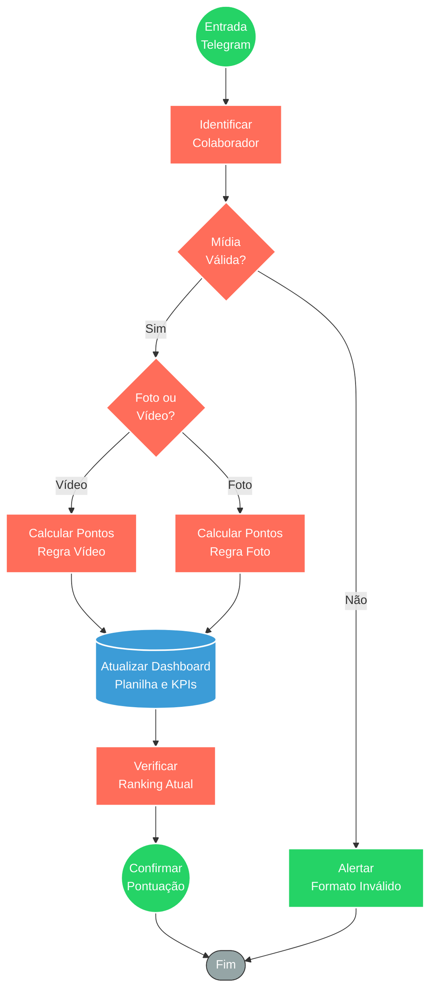

## ⚡ Bot de Gamificação e Coleta de Conteúdo (Telegram)

#### 🧠 Lógica do Processo
Este workflow implementa uma estratégia de **gamificação interna** para incentivar colaboradores (vendas e logística) a documentarem entregas e experiências com clientes. O processo inicia quando o colaborador envia arquivos de mídia via Telegram. O sistema identifica o remetente, valida o conteúdo e classifica o tipo de arquivo recebido, aplicando regras de pontuação distintas (ex: vídeos geram mais pontos que fotos). Esses dados alimentam automaticamente um **Dashboard de Performance** (planilha ou banco de dados), atualizando o ranking da equipe. Por fim, o bot envia um feedback imediato ao colaborador confirmando a pontuação recebida, fechando o ciclo de recompensa e engajamento.

---

### 🏗️ Diagrama de Arquitetura

---

### 🔍 Dicionário de Dados

#### 1. Interface de Comunicação

* **Bot Telegram (Entrada/Saída)**
* **Função:** Canal oficial de comunicação interna. Recebe as evidências (mídia) e atua como interface de feedback para o colaborador.
* **Entrada principal:** Arquivos de mídia (foto/vídeo) e ID do usuário Telegram.
* **Saída principal:** Mensagem de texto com saldo de pontos e confirmação de recebimento.

#### 2. Motor de Regras e Gamificação

* **Identificador de Colaborador**
* **Função:** Mapeia o ID do Telegram para o registro do funcionário (Vendas ou Logística) para garantir a atribuição correta dos pontos.
* **Observações:** Filtra usuários não autorizados.

* **Calculadora de Pontuação**
* **Função:** Aplica a lógica de negócio definida para transformar a interação em valor numérico (score).
* **Regra de Negócio:** Vídeos podem ter um peso/multiplicador maior que fotos estáticas.

#### 3. Gestão de Dados

* **Dashboard de Performance (Planilha/DB)**
* **Função:** Base central da verdade para a premiação. Armazena o histórico de envios, links das mídias e o saldo acumulado.
* **Entrada principal:** ID do colaborador, Data/Hora, Link da Mídia, Pontos gerados.
* **Saída principal:** Dados consolidados para visualização da gestão.
