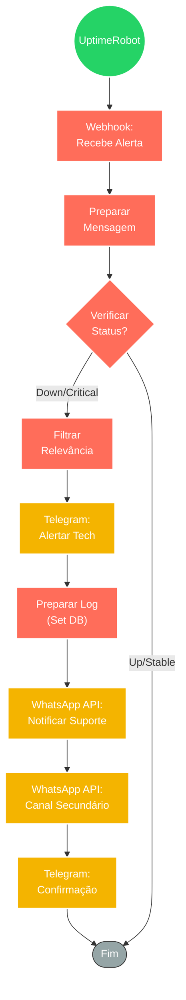

## ⚡ Monitor de Estabilidade de API (UptimeRobot & NoCodeBackend)

#### 🧠 Lógica do Processo: Este workflow atua como um "Sentinela Digital" para infraestrutura crítica. Ele recebe webhooks de serviços de monitoramento (como UptimeRobot) sinalizando instabilidade ou queda na API do NoCodeBackend. Ao receber o alerta, o fluxo processa a mensagem para extrair detalhes técnicos, filtra falsos positivos e executa uma cadeia de notificações de emergência. O sistema dispara alertas imediatos via Telegram para a equipe técnica e, simultaneamente, registra o incidente e aciona canais secundários (WhatsApp) para garantir que a equipe de suporte esteja ciente da indisponibilidade, permitindo uma resposta rápida a incidentes.

---

### 🏗️ Diagrama de Arquitetura:

---

### 🔍 Dicionário de Dados

#### 1. Monitoramento e Gatilho

* **Webhook UptimeRobot** `(Nó: Webhook)`
* **Função:** Listener de Incidentes. Recebe requisições POST do UptimeRobot (ou sistema similar) contendo o status do monitor, tempo de resposta e detalhes do erro quando a API do NoCodeBackend apresenta falhas.

#### 2. Processamento e Lógica

* **Preparação de Dados** `(Nó: Preparar Mensagem)`
* **Função:** Normalização. Formata o JSON bruto recebido do monitoramento em uma mensagem legível para humanos, destacando o serviço afetado e o horário do incidente.

* **Filtros de Decisão** `(Nós: Verifica / Filter)`
* **Função:** Triagem de Crise.
* **Verifica:** Analisa se o status recebido exige ação imediata (ex: ignora avisos de "manutenção programada" se configurado).
* **Filter:** Garante que apenas alertas críticos passem para a etapa de notificação em massa, evitando fadiga de alertas na equipe.

#### 3. Notificação e Escalabilidade

* **Bot Telegram** `(Nós: Ligação telegram / Aviso Telegram1)`
* **Função:** Sala de Guerra. Envia mensagens instantâneas para grupos de desenvolvedores ou admin, informando a queda do serviço para início imediato do troubleshooting.

* **Integração WhatsApp** `(Nós: whatsapp / whatsapp2)`
* **Função:** Redundância de Alerta. Utiliza uma API de WhatsApp para enviar alertas para números críticos ou grupos de suporte, garantindo que o alerta seja visto mesmo se o Telegram for ignorado.

