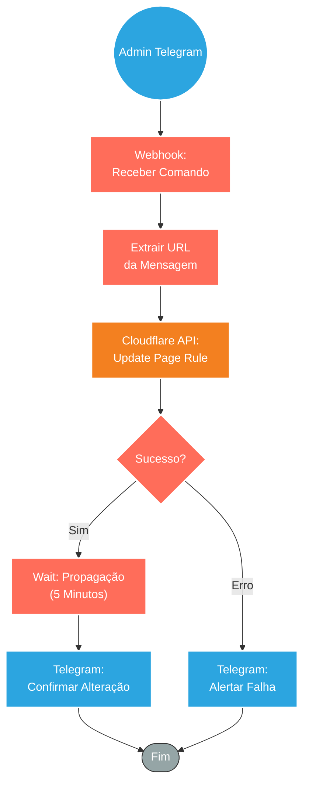

## ⚡ Bot de Gestão de Redirecionamentos via Telegram (ChatOps)

#### 🧠 Lógica do Processo: Este workflow transforma o Telegram em um terminal de comando para gestão de infraestrutura. O administrador envia a nova URL de destino diretamente no chat do bot. O sistema captura essa mensagem via Webhook, valida se é um link seguro e executa a atualização da **Page Rule** na API da Cloudflare. Após aplicar a mudança, o fluxo aguarda um período de segurança (propagação de DNS/Edge) e devolve uma mensagem no próprio Telegram confirmando que o redirecionamento foi alterado com sucesso, permitindo gestão ágil em eventos ao vivo sem acesso a painéis complexos.

---

### 🏗️ Diagrama de Arquitetura:

---

### 🔍 Dicionário de Dados

#### 1. Interface de Comando (Telegram)

* **Webhook de Entrada** `(Nó: Webhook / Telegram Trigger)`
* **Função:** Receptor de Comandos. Ouve as mensagens enviadas para o Bot. O administrador envia apenas o link (ex: `https://youtube.com/live/exemplo123`) e o workflow captura esse texto como o payload `text`.

* **Extrator** `(Nó: Set / Code)`
* **Função:** Tratamento. Limpa a mensagem recebida para garantir que apenas a URL seja enviada para a API, removendo espaços em branco ou textos adicionais.

#### 2. Infraestrutura (Cloudflare)

* **Cloudflare API** `(Nó: Mudar url)`
* **Ação:** `PATCH Page Rule`
* **Lógica:** Utiliza o ID da Zona e o ID da Regra (fixos ou dinâmicos) para atualizar o campo `forwarding_url` com o link recebido do Telegram.
* **Impacto:** Altera imediatamente o comportamento do domínio principal (ex: `live.meudominio.com`), que passará a redirecionar o usuário para a nova URL do YouTube/Zoom fornecida.

#### 3. Feedback e Segurança

* **Timer de Segurança** `(Nó: Aguarda 5 minutos)`
* **Função:** Garantia de Qualidade. Como a Cloudflare replica a configuração para servidores no mundo todo, o fluxo aguarda a propagação completa antes de dar o "OK" final.

* **Notificação de Retorno** `(Nó: Envia Msg)`
* **Função:** Resposta do Bot. Envia uma mensagem de volta ao administrador: *"✅ URL atualizada com sucesso! O redirecionamento já está ativo."*

