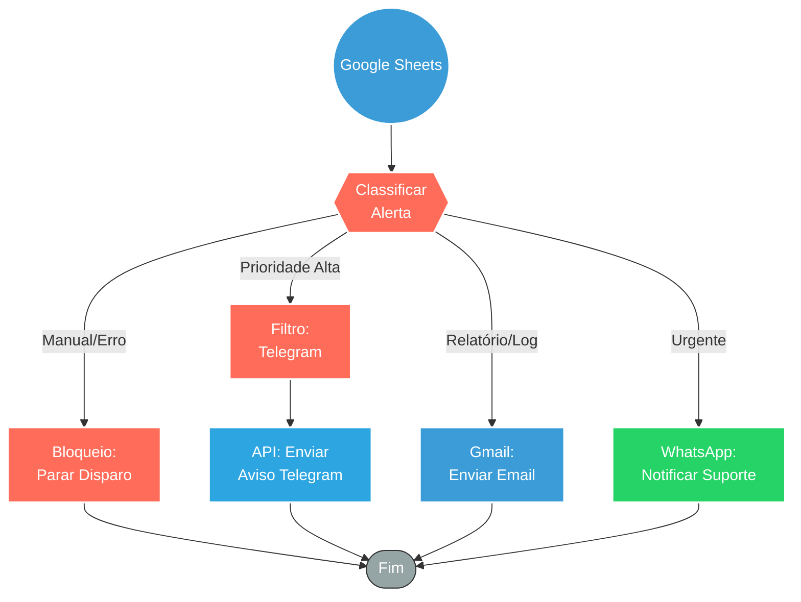

## ⚡ Sistema de Notificações e Alertas Multicanal (Google Sheets)

#### 🧠 Lógica do Processo: Este workflow funciona como uma central de despacho de alertas operacionais. Ele monitora ou recebe dados provenientes de planilhas do **Google Sheets** e, baseando-se na urgência ou tipo do evento (`$json.tipo`), roteia a notificação para o canal mais adequado. O sistema possui filtros lógicos que decidem se o alerta deve ser enviado via **Email (Gmail)** para formalização, **Telegram** para aviso imediato à equipe técnica, ou **WhatsApp** para comunicação direta. Inclui também travas de segurança ("Parar disparo") para evitar loops ou execuções manuais acidentais, garantindo que apenas eventos reais disparem as mensagens.

---

### 🏗️ Diagrama de Arquitetura:

---

### 🔍 Dicionário de Dados

#### 1. Entrada e Roteamento

* **Gatilho/Input** `(Contexto Sheets)`
* **Função:** Origem dos Dados. O fluxo é alimentado por dados estruturados contendo o `tipo` do alerta e a `mensagem_gmail`, geralmente vindos de uma atualização em planilha.

* **Filtros Lógicos** `(Nós: Filter / Filter1)`
* **Função:** Triagem. Analisa o payload de entrada para determinar qual canal de comunicação deve ser acionado. Por exemplo, evita mandar logs simples para o WhatsApp, reservando esse canal apenas para erros críticos.

#### 2. Canais de Comunicação

* **Gmail** `(Nó: Gmail)`
* **Função:** Notificação Formal. Dispara e-mails formatados (HTML/Texto) para destinatários específicos com assuntos dinâmicos (`🚨 Alerta {{ $json.tipo }}`). Ideal para registros de auditoria e relatórios diários.

* **Telegram Bot** `(Nós: Ligação telegram / Aviso Telegram)`
* **Função:** *War Room*. Envia alertas rápidos para grupos de monitoramento da equipe, permitindo reação imediata a incidentes.

* **WhatsApp** `(Nós: whatsapp2)`
* **Função:** Canal Crítico. Utilizado para garantir que a notificação chegue ao responsável mesmo que ele não esteja monitorando e-mails ou Telegram.

#### 3. Controle e Segurança

* **Trava de Execução** `(Nó: Parar o dispara acionado manualmente)`
* **Função:** Circuit Breaker. Uma lógica condicional (`If`) desenhada para interromper o fluxo caso identifique que o disparo foi feito manualmente de forma indevida ou se os critérios de segurança não forem atendidos, prevenindo spam interno.
