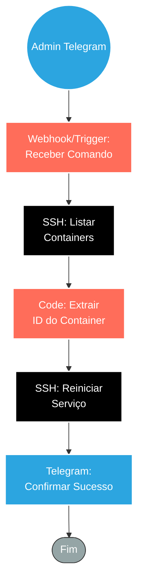

## ⚡ Bot de Reinicialização de Infraestrutura via Telegram (ChatOps)

#### 🧠 Lógica do Processo: Este workflow implementa práticas de **ChatOps**, permitindo que a equipe de DevOps reinicie serviços críticos (como containers Docker) diretamente pelo chat do Telegram. Ao receber um comando autorizado (ex: `/restart n8n`), o sistema conecta-se ao servidor via **SSH** e executa uma listagem dos containers ativos (`docker ps`). Um script em Javascript processa o retorno do terminal para isolar o **Container ID** do serviço solicitado. Por fim, uma segunda conexão SSH executa o reinício forçado (`docker restart`) e o bot devolve uma mensagem no Telegram confirmando que o serviço está operacional novamente.

---

### 🏗️ Diagrama de Arquitetura:

---

### 🔍 Dicionário de Dados

#### 1. Interface de Comando (ChatOps)

* **Gatilho Telegram** `(Nó: Telegram Trigger)`
* **Função:** Terminal Remoto. Monitora um chat privado ou grupo de operações em busca de comandos específicos.
* **Segurança:** É fundamental validar o `User ID` ou `Chat ID` de origem para garantir que apenas administradores autorizados possam reiniciar a infraestrutura.

#### 2. Diagnóstico e Processamento

* **SSH - Listagem** `(Nó: SSH)`
* **Função:** Auditoria. Conecta-se ao servidor Linux e executa `sudo docker ps | grep [nome_do_servico]`. Isso garante que estamos operando sobre um container que realmente está rodando.

* **Parser de ID** `(Nó: Code)`
* **Função:** Extração de Dados. Recebe a string bruta do terminal (ex: `a1b2c3d4e5f6 n8nio/n8n...`) e utiliza Regex para capturar apenas o ID dinâmico do container, evitando erros de digitação manual.

#### 3. Execução e Feedback

* **SSH - Reinicialização** `(Nó: SSH1)`
* **Função:** Ação Crítica. Recebe o ID extraído e executa `sudo docker restart {{ $json.containerId }}`, aplicando a reinicialização limpa do serviço.

* **Notificação de Retorno** `(Nó: Envia Msg)`
* **Função:** Confirmação. O bot responde à mensagem original do administrador: *"✅ Serviço reiniciado com sucesso via Container ID: a1b2c3..."*, fechando o ciclo de operação.
