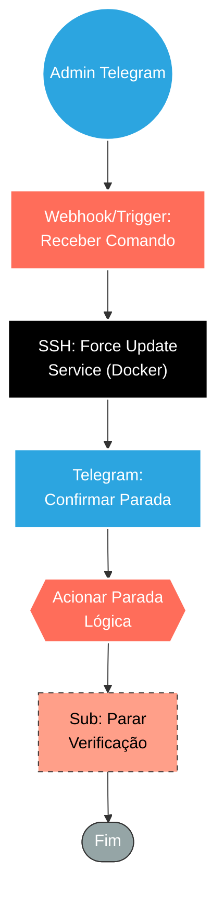

## ⚡ Bot de Parada de Emergência via Telegram (Kill Switch)

#### 🧠 Lógica do Processo: Este workflow implementa um **Kill Switch** (Botão de Pânico) baseado em **ChatOps**. Quando a operação de disparos apresenta anomalias críticas (travamento ou envio em massa incorreto), o administrador envia um comando de parada via **Telegram**. O sistema recebe essa ordem e atua em duas frentes: (1) **Infraestrutura**, conectando-se via SSH para forçar a reinicialização limpa do serviço Docker (`force update`), eliminando processos travados; e (2) **Lógica**, acionando o encerramento imediato de sub-fluxos de negócio, garantindo que a operação pare totalmente.

---

### 🏗️ Diagrama de Arquitetura:

---

### 🔍 Dicionário de Dados

#### 1. Interface de Comando (ChatOps)

* **Gatilho Telegram** `(Nó: Webhook / Telegram Trigger)`
* **Função:** Acionador de Emergência. Monitora o chat por um comando específico (ex: `/panic` ou `/stop_all`). A origem (ID do usuário) deve ser restrita para evitar sabotagem.
* **Ação:** Inicia a cadeia de desligamento ao receber o comando.

#### 2. Infraestrutura (Hard Reset)

* **Comando SSH** `(Nó: Servidor n8n)`
* **Função:** Intervenção Física. Conecta-se ao servidor Linux e executa `sudo docker service update --force n8n-disparo_n8n`.
* **Objetivo:** Diferente de um "stop" comum, o *force update* recria os containers do serviço. Isso mata instantaneamente qualquer processo travado na memória RAM e limpa o estado da aplicação de disparos.
* **Limpeza:** Executa em sequência `docker container prune -f` para remover os containers mortos.

#### 3. Controle de Fluxo (Soft Stop)

* **Orquestrador de Parada** `(Nó: Parar o dispara acionado manualmente)`
* **Função:** Hub de Encerramento. Após resetar o Docker, este nó garante que os processos lógicos do n8n também saibam que devem parar.

* **Sub-rotinas de Encerramento** `(Nós: Parar verificação...)`
* **Função:** Parada Lógica. Executa workflows auxiliares que alteram flags no banco de dados ou cancelam filas de agendamento, impedindo que o sistema tente reiniciar os disparos automaticamente assim que o Docker voltar.

#### 4. Feedback

* **Notificação de Status** `(Nós: Envia Msg)`
* **Função:** Relatório. Devolve ao admin no Telegram a confirmação: *"🛑 Serviço reiniciado e fluxos lógicos interrompidos com sucesso."*

