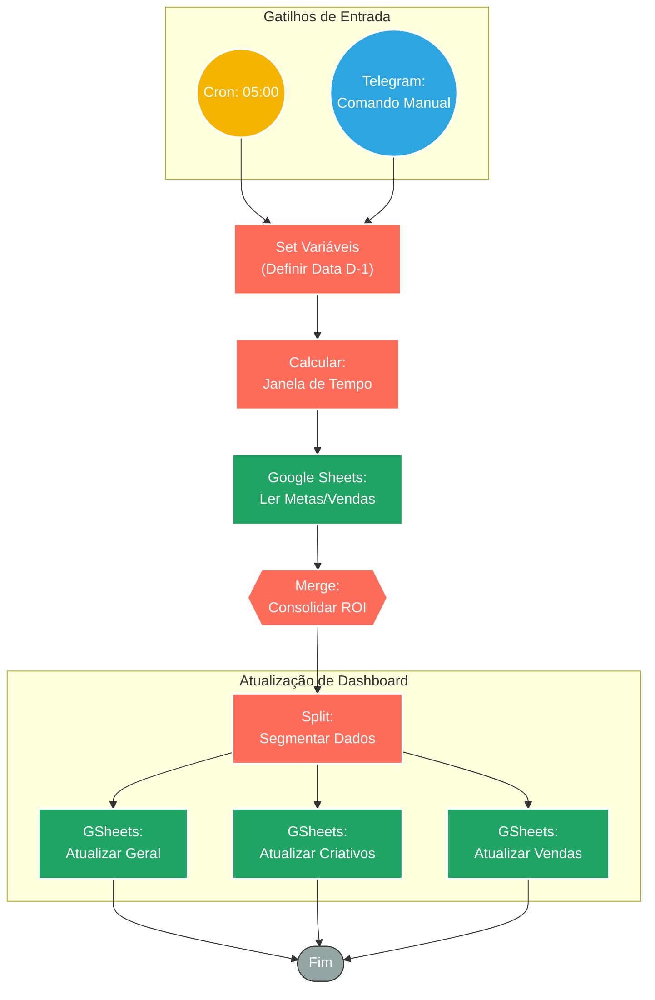

## ⚡ Bot de Relatórios de Tráfego Pago (Facebook Ads & Telegram)

#### 🧠 Lógica do Processo: Este workflow automatiza a geração do DRE e métricas de tráfego, funcionando de forma híbrida: **Automática** (todos os dias às 05:00) e **Sob Demanda** (via comando no Telegram). Ao ser acionado, o sistema define o período de análise (geralmente D-1/"Ontem"), extrai os custos do Facebook Ads e cruza com a receita registrada no Google Sheets. O diferencial é a interface via Telegram: o gestor pode solicitar uma atualização fora do horário padrão enviando um comando, e o fluxo processa, consolida os dados (`Merge`) e atualiza as planilhas de gestão, garantindo números sempre frescos para tomada de decisão.

---

### 🏗️ Diagrama de Arquitetura:

---

### 🔍 Dicionário de Dados

#### 1. Entradas (Híbridas)

* **Telegram Webhook** `(Nó: Webhook)`
* **Função:** Gatilho Manual (ChatOps). Permite que o gestor de tráfego force a geração do relatório a qualquer momento enviando um comando no chat. O fluxo recebe a requisição, ignora o agendamento e roda a lógica de consolidação imediatamente.

* **Cron Trigger** `(Nó: Todo dia 05:00)`
* **Função:** Rotina Agendada. Garante que, antes do início do expediente, os dados do dia anterior já estejam processados na planilha, sem dependência humana.

#### 2. Lógica de Negócio

* **Definição Temporal** `(Nós: Set Variáveis / Dados de Ontem)`
* **Função:** Padronização. Independente da origem do disparo (Telegram ou Cron), o sistema calcula a data de "Ontem" para buscar o fechamento correto das métricas de ads e vendas.

* **Consolidação (ETL)** `(Nós: Merge / Separa os dados)`
* **Função:** Cruzamento de Dados. Une as informações de **Gasto** (Facebook Ads) com **Faturamento** para calcular métricas compostas como ROAS (Retorno sobre Investimento em Anúncios) e CPA (Custo por Aquisição).

#### 3. Saída e Visualização

* **Google Sheets** `(Nós de Escrita)`
* **Função:** Banco de Dados Frontend. O n8n atua apenas como processador; os dados finais são persistidos em abas específicas da planilha mestre, que alimenta os dashboards visuais da equipe de marketing.

