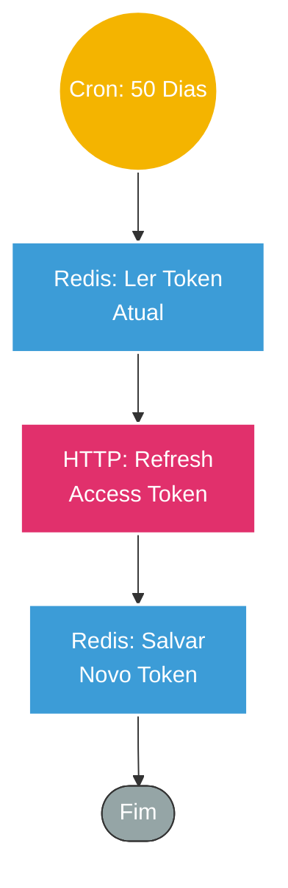

## ⚡ Sistema de Renovação Automática de Token (Instagram API)

#### 🧠 Lógica do Processo: Este workflow atua como um mecanismo de manutenção preventiva ("Self-Healing") para credenciais de redes sociais. O Instagram Graph API exige que os tokens de acesso de longa duração sejam renovados a cada 60 dias. Para evitar a desconexão das automações, este fluxo é executado automaticamente a cada 50 dias (margem de segurança). Ele recupera o token atual armazenado no banco **Redis**, envia uma solicitação de renovação para a API do Facebook/Instagram e, ao receber o novo token válido, atualiza o registro no banco de dados. Isso garante perenidade às integrações sem intervenção manual.

---

### 🏗️ Diagrama de Arquitetura:

---

### 🔍 Dicionário de Dados

#### 1. Agendamento e Gatilho

* **Schedule Trigger** `(Nó: Schedule Trigger)`
* **Função:** Cron Job. Configurado para disparar a cada **50 dias**.
* **Estratégia:** Os tokens do Instagram expiram em 60 dias. A execução no dia 50 cria uma janela de segurança de 10 dias, garantindo que o token nunca expire antes da renovação.

#### 2. Gestão de Estado (Redis)

* **Redis (Leitura)** `(Nó: Redis1)`
* **Função:** Recuperação de Contexto. Busca a chave `instagram_access_token` no banco em memória para obter a credencial que está prestes a vencer.

* **Redis (Escrita)** `(Nó: Redis)`
* **Função:** Persistência. Após a resposta da API, sobrescreve a chave `instagram_access_token` com o novo hash recebido, disponibilizando-o imediatamente para outros workflows que dependem dessa autenticação.

#### 3. Integração Externa

* **Instagram API** `(Nó: HTTP Request)`
* **Endpoint:** `GET /refresh_access_token`
* **Parâmetros:**
* `grant_type`: `ig_refresh_token`
* `access_token`: Token atual (vindo do Redis).

* **Função:** Troca de Chaves. Solicita à Meta a extensão da validade da sessão, retornando um novo token válido por mais 60 dias.
