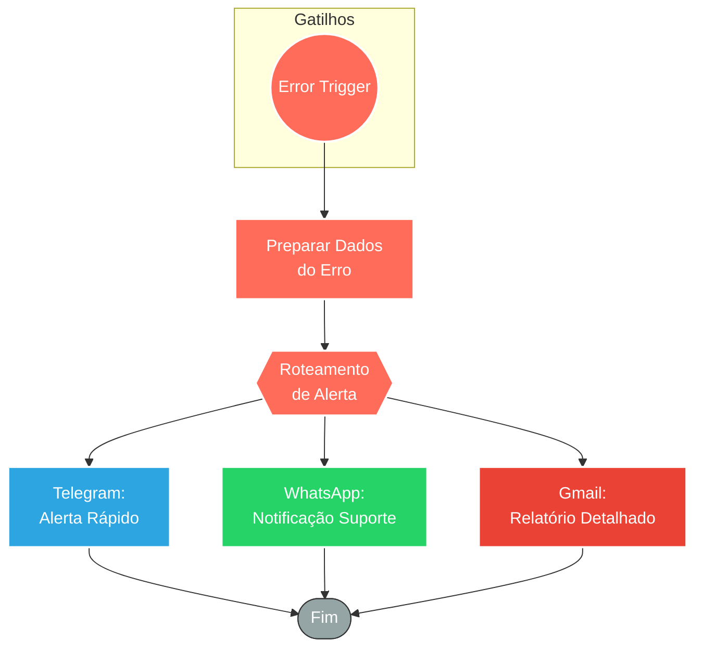

## ⚡ Sistema de Report de Erros e Monitoramento de Falhas

#### 🧠 Lógica do Processo: Este workflow atua como um "Error Handler" (Manipulador de Erros) global para a operação. Ele é acionado automaticamente quando outros fluxos falham (via Error Trigger) ou pode ser disparado periodicamente para verificações de saúde (Schedule). Sua função principal é capturar o contexto do erro (qual fluxo, qual nó, mensagem de stack trace) e distribuir alertas multicanais. O sistema prioriza a notificação via **E-mail (Gmail)** para formalização detalhada e **Telegram/WhatsApp** para avisos imediatos à equipe técnica. Além disso, ele interage com o **Redis** para controle de estado ou logging, garantindo que falhas críticas não passem despercebidas.

---

### 🏗️ Diagrama de Arquitetura:

---

### 🔍 Dicionário de Dados

#### 1. Monitoramento e Gatilhos

* **Error Workflow Trigger** `(Implícito na lógica de erro)`
* **Função:** Captura de Exceção. Este fluxo é configurado nas configurações de "Error Workflow" dos outros processos. Quando qualquer nó falha na produção, este gatilho recebe o objeto JSON contendo: nome do workflow, nó que falhou, mensagem de erro e link da execução.

#### 2. Canais de Notificação

* **Gmail** `(Nó: Gmail)`
* **Função:** Registro Formal. Envia um e-mail estruturado para o administrador.
* **Conteúdo:** Inclui o nome do workflow, a mensagem de erro técnica (`execution.error.message`), a stack trace e a URL direta para inspecionar a execução falha no painel do n8n.

* **Telegram Bot** `(Nós: Ligação telegram / Aviso Telegram1)`
* **Função:** Sala de Guerra. Envia alertas instantâneos para o grupo de desenvolvedores, permitindo reação rápida antes que o usuário final perceba a indisponibilidade.

* **WhatsApp** `(Nós: whatsapp2 / whatsapp3)`
* **Função:** Redundância. Caso o e-mail ou Telegram sejam ignorados, o WhatsApp serve como canal de alta prioridade para garantir a entrega do alerta.

#### 3. Persistência e Controle

* **Redis** `(Nós: Redis set direto1 / set)`
* **Função:** Gestão de Estado. Pode ser utilizado para:
* Armazenar a contagem de erros (para evitar *flood* de notificações se o erro for repetitivo).
* Registrar o último horário de falha.
* Atuar como buffer antes de enviar notificações em lote.
