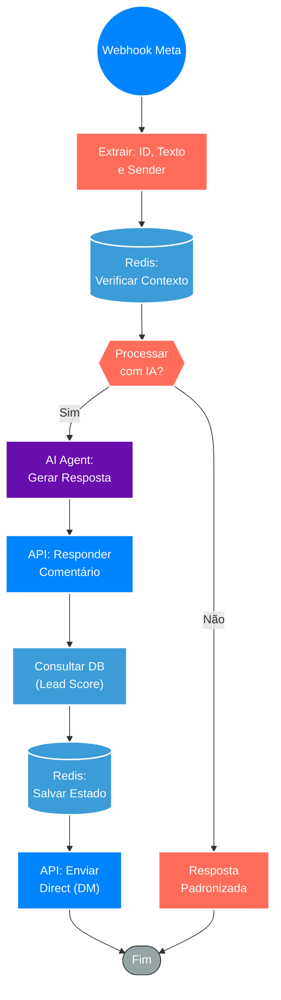

## ⚡ Sistema de Resposta Automática a Comentários com IA (Meta/Instagram)

#### 🧠 Lógica do Processo: Este workflow atua como um *Community Manager* automatizado para redes sociais (Facebook/Instagram). O processo é acionado via **Webhook** sempre que uma publicação recebe um novo comentário. O sistema extrai os dados do autor e do texto, consulta o **Redis** para verificar o contexto ou evitar duplicidade e utiliza um **Agente de IA** para analisar o sentimento e gerar uma resposta humanizada e contextual. Dependendo da estratégia definida (lógica condicional), o fluxo pode postar a resposta publicamente no comentário e, simultaneamente, enviar uma mensagem privada (Direct/DM) para o usuário, aumentando as taxas de conversão e engajamento.

---

### 🏗️ Diagrama de Arquitetura:

---

### 🔍 Dicionário de Dados

#### 1. Ingestão e Tratamento

* **Webhook Meta** `(Nó: Webhook1)`
* **Função:** Gatilho de Evento. Recebe o payload JSON da API do Facebook/Instagram contendo o `senderId` (quem comentou), o `comentarioId` e o `texto` da interação.

* **Normalização** `(Nó: Edit Fields/Code)`
* **Função:** Preparação. Mapeia os campos aninhados do JSON bruto (ex: `entry[0].changes[0].value.text`) para variáveis limpas utilizáveis pelo restante do fluxo.

#### 2. Inteligência e Memória

* **Redis** `(Nós: Redis / Redis1)`
* **Função:** Gestão de Estado e Deduplicação.
* **Leitura:** Verifica se aquele comentário já foi respondido para evitar loops infinitos.
* **Escrita:** Registra a interação realizada, criando um histórico de curto prazo para o usuário.

* **Agente de IA** `(Nó: AI Agent)`
* **Função:** Geração de Conteúdo. Recebe o texto do comentário e, baseado em um *System Prompt* (persona), gera uma resposta criativa, empática e alinhada ao tom de voz da marca, evitando respostas robóticas.

#### 3. Ação e Engajamento

* **Publicação de Resposta** `(Nó: resposta do comentário)`
* **Função:** Interação Pública. Realiza a chamada à Graph API para postar o texto gerado pela IA como uma resposta direta ao comentário original.

* **Envio de Direct** `(Nó: Envia direct)`
* **Função:** Conversão Privada. Aproveita o gatilho do comentário para iniciar uma conversa no inbox (DM) do usuário, enviando materiais ricos, links de oferta ou continuado o atendimento de forma privada.
