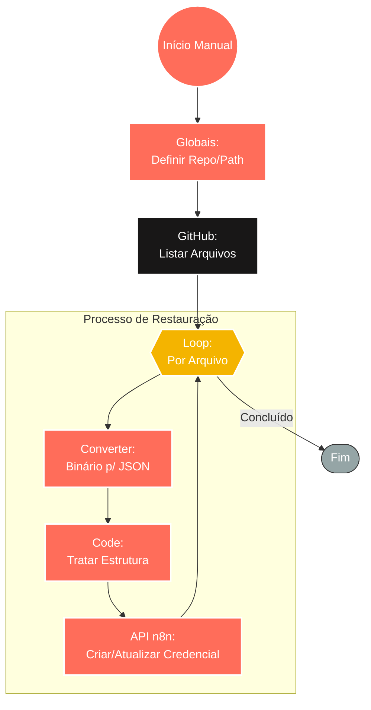

## ⚡ Sistema de Restauração de Credenciais (Git > n8n)

#### 🧠 Lógica do Processo: Este workflow atua como um mecanismo de **Disaster Recovery** (Recuperação de Desastres) e migração para o n8n. Acionado manualmente, ele se conecta a um repositório privado no **GitHub** para recuperar arquivos de backup de credenciais (JSON). O fluxo itera sobre cada arquivo encontrado, realiza a conversão e decodificação necessária via código, e injeta as credenciais de volta na instância do n8n. Isso permite restaurar rapidamente o acesso a serviços externos após uma migração de servidor ou reinstalação, sem a necessidade de recadastrar senhas manualmente.

---

### 🏗️ Diagrama de Arquitetura:

---

### 🔍 Dicionário de Dados

#### 1. Configuração e Fonte

* **Globais** `(Nó: Globais)`
* **Função:** Definição de Escopo. Estabelece as variáveis de ambiente para o fluxo, como o dono do repositório (`repo.owner`), nome do repositório (`repo.name`) e o caminho da pasta onde estão os backups (`repo.path`).

* **Conector GitHub** `(Nó: Obter conteúdo do arquivo do GitHub)`
* **Função:** Leitura de Repositório. Conecta-se à API do GitHub para listar todos os arquivos JSON presentes na pasta de credenciais especificada, baixando seus metadados e conteúdo bruto.

#### 2. Processamento Iterativo

* **Loop de Arquivos** `(Nó: Loop Over Items)`
* **Função:** Controle de Fluxo. Garante que cada arquivo de credencial baixado seja processado individualmente, evitando sobrecarga ou erros de lote na API do n8n.

* **Conversor de Formato** `(Nó: Converter arquivos para JSON)`
* **Função:** Deserialização. Transforma o conteúdo do arquivo (que muitas vezes vem como binário ou texto bruto do GitHub) em um objeto JSON estruturado que o n8n consegue manipular.

#### 3. Restauração e Persistência

* **Tratamento de Dados** `(Nó: Code)`
* **Função:** Normalização. Ajusta a estrutura do JSON importado para o formato exato esperado pela API interna de credenciais do n8n (ex: descriptografia de valores se necessário, ajuste de IDs).

* **Restaurador de Credenciais** `(Nó: Restaurar Credenciais do n8n)`
* **Função:** Ação de Sistema. Executa a criação ou atualização da credencial na instância atual do n8n, restabelecendo a conexão com serviços terceiros (bancos de dados, APIs, CRMs) automaticamente.
