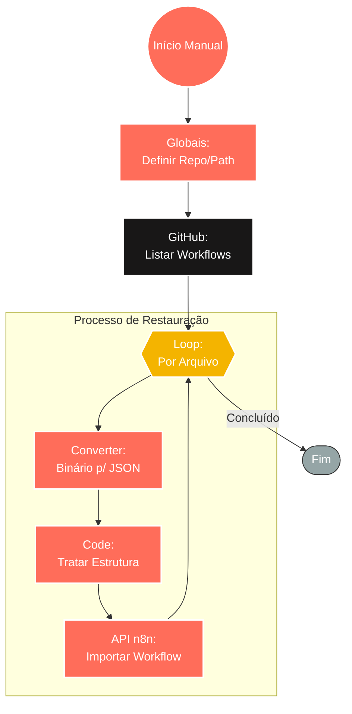

## ⚡ Sistema de Restauração de Workflows (Git > n8n)

#### 🧠 Lógica do Processo: Este workflow atua como um mecanismo de **Disaster Recovery** (Recuperação de Desastres) e migração em massa para a instância do n8n. Acionado manualmente, o sistema conecta-se a um repositório privado no **GitHub** para listar e recuperar os arquivos JSON dos fluxos de automação armazenados. O processo itera sobre cada arquivo encontrado, converte o conteúdo binário baixado para o formato JSON estruturado e realiza o tratamento de dados necessário via código. Por fim, utiliza a API interna do n8n para importar, criar ou atualizar os workflows na instância ativa, permitindo a restauração completa do ambiente em minutos.

---

### 🏗️ Diagrama de Arquitetura:

---

### 🔍 Dicionário de Dados

#### 1. Configuração e Fonte

* **Globais** `(Nó: Globais)`
* **Função:** Definição de Escopo. Estabelece as variáveis de ambiente essenciais, como o dono do repositório (`repo.owner`), nome do repositório (`repo.name`) e o caminho da pasta onde os backups dos workflows estão salvos (`repo.path`, ex: `workflows1/`).

* **Conector GitHub** `(Nó: Obter conteúdo do arquivo do GitHub)`
* **Função:** Leitura de Repositório. Conecta-se à API do GitHub para listar todos os arquivos `.json` presentes na pasta especificada, baixando os metadados necessários para o download do conteúdo.

#### 2. Processamento Iterativo

* **Loop de Arquivos** `(Nó: Loop Over Items)`
* **Função:** Controle de Fluxo. Garante que cada workflow listado seja processado sequencialmente. Isso é crucial para não sobrecarregar a API do n8n e garantir que cada importação seja validada individualmente.

* **Conversor de Formato** `(Nó: Converter arquivos para JSON)`
* **Função:** Deserialização. Transforma o conteúdo do arquivo (que a API do GitHub pode entregar como binário ou stream) em um objeto JSON manipulável pelo n8n.

#### 3. Restauração e Importação

* **Tratamento de Dados** `(Nó: Code)`
* **Função:** Normalização. Ajusta a estrutura do JSON importado, garantindo que campos como `nodes`, `connections` e `settings` estejam no formato exato que a API de importação do n8n exige.

* **Restaurador de Workflows** `(Nó: Restaurar Workflows n8n)`
* **Função:** Ação de Sistema. Executa a criação (se novo) ou atualização (se já existente) do workflow na instância atual do n8n, restabelecendo a lógica de automação conforme o backup.
