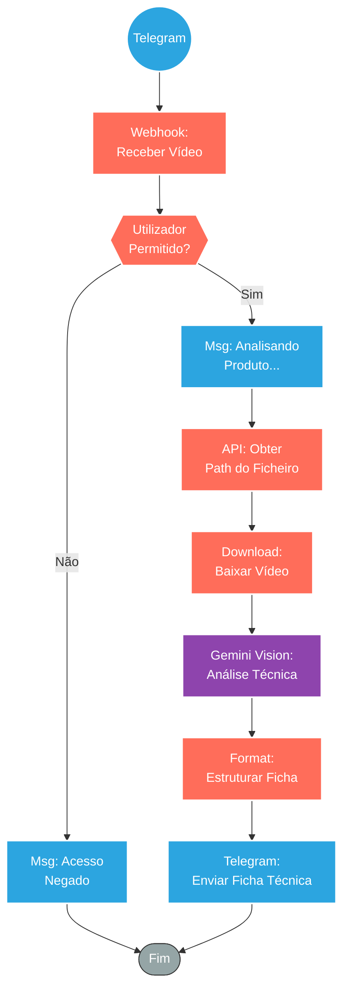

## ⚡ Bot de Análise e Catalogação de Produtos via Vídeo (Gemini Vision)

#### 🧠 Lógica do Processo: Este workflow transforma o Telegram num terminal de catalogação inteligente. Ao receber um vídeo de um produto (sem necessidade de áudio explicativo), o sistema utiliza o modelo **Google Gemini 1.5 Flash** para realizar uma análise visual "frame-a-frame". O prompt do sistema instrui a IA a ignorar o marketing e focar em **extração de dados técnicos**: identifica o produto, isola 3 características funcionais mensuráveis, 2 benefícios práticos e 1 diferencial tecnológico. O resultado não é uma transcrição, mas sim uma ficha técnica padronizada (Nome - Categoria - Specs) pronta para ser inserida num ERP ou catálogo de e-commerce.

---

### 🏗️ Diagrama de Arquitetura:

---

### 🔍 Dicionário de Dados

#### 1. Entrada e Segurança

* **Webhook Telegram** `(Nó: Webhook)`
* **Função:** Ingestão Visual. Recebe o ficheiro de vídeo (`video/mp4`) enviado pelo colaborador em campo (ex: armazém ou showroom).

* **Controle de Acesso** `(Nó: Usuário permitido?)`
* **Função:** Segurança. Garante que apenas a equipa técnica autorizada possa consumir os créditos da API do Google, validando o `User ID`.

#### 2. Engenharia de Prompt (O Cérebro)

* **Google Gemini 1.5** `(Nó: Google Gemini Chat Model)`
* **Capacidade:** Multimodalidade Nativa. O modelo analisa os pixels do vídeo, não apenas o áudio.
* **Prompt do Sistema:** Configurado com rigor técnico (`temperature: 0.3`) para evitar "alucinações" criativas.
* **Objetivo:** Identificação técnica e funcional.
* **Template de Saída:** Obriga a IA a responder no formato: `[Nome] - [Categoria]\n - [Característica] com [Especificação]`.
* **Restrições:** Proíbe emojis e linguagem promocional, focando em dados verificáveis (ex: "Aço Inox 304" em vez de "Aço resistente").

#### 3. Output Estruturado

* **Tratamento de Resposta** `(Nó: Processar Resposta)`
* **Função:** Padronização. Recebe o texto gerado e devolve ao utilizador uma mensagem pronta para "Copiar e Colar" na descrição do produto no site ou sistema de gestão, poupando tempo de redação manual.
