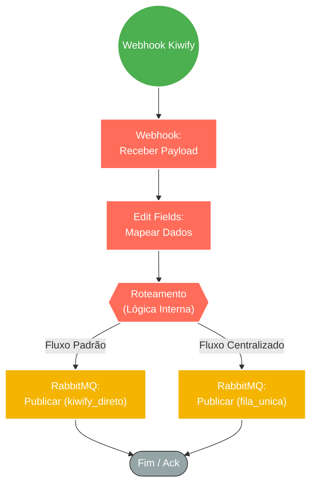

## ⚡ Sistema de Ingestão de Webhooks Kiwify para Fila RabbitMQ

#### 🧠 Lógica do Processo: Este workflow atua como o ponto de entrada principal (Gateway) para eventos de vendas e atualizações da plataforma Kiwify. Ele recebe o webhook, valida a estrutura básica e roteia os dados para uma fila dedicada no **RabbitMQ** (`kiwify_direto`). O objetivo principal é garantir alta disponibilidade e desacoplamento: o webhook responde rapidamente à Kiwify (evitando *timeouts*), enquanto o processamento pesado (envio de mensagens, atualização de banco, etc.) é delegado para *workers* que consumirão a fila posteriormente. O fluxo também possui uma rota secundária (legada ou específica) que direciona certos eventos para uma "Fila Única".

---

### 🏗️ Diagrama de Arquitetura:

---

### 🔍 Dicionário de Dados

#### 1. Ingestão de Eventos

* **Webhook Kiwify** `(Nó: Webhook)`
* **Função:** Listener HTTP POST. Configurado para receber notificações de eventos da Kiwify (Venda Aprovada, Pix Gerado, Boleto, Reembolso, Carrinho Abandonado).
* **Endpoint:** `kiwify/zap`
* **Payload:** Recebe o JSON completo da transação, incluindo dados do cliente (nome, telefone, email), produto (ID, nome) e detalhes financeiros.

#### 2. Normalização e Tratamento

* **Mapeamento de Dados** `(Nó: Execution Data / Edit Fields)`
* **Função:** Preparação. Seleciona e estrutura os campos essenciais do payload recebido para garantir que o formato enviado para a fila seja consistente, facilitando o trabalho dos *workers* consumidores.

#### 3. Mensageria e Distribuição

* **RabbitMQ Producer** `(Nó: RabbitMQ / fila unica)`
* **Função:** Buffer de Alta Performance.
* **Fila `kiwify_direto`:** Destino principal para processamento imediato de notificações de vendas específicas.
* **Fila `fila_unica`:** Destino alternativo, possivelmente utilizado para centralizar disparos de mensagens genéricas ou logs unificados.

* **Configuração:** Utiliza filas do tipo `quorum` para garantir segurança e replicação dos dados, com persistência ativada (`durable: true`), assegurando que nenhuma venda seja perdida mesmo em caso de reinício do broker.

