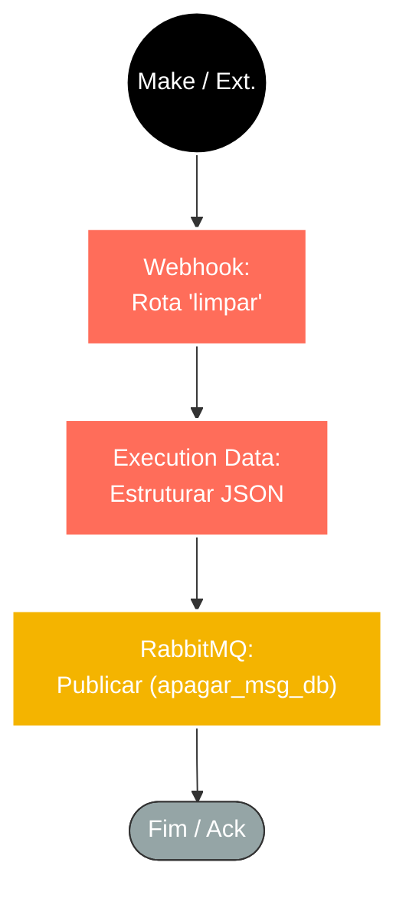

## ⚡ Gateway de Limpeza de Mensagens (Webhook > RabbitMQ)

#### 🧠 Lógica do Processo: Este workflow funciona como um ponto de ingestão assíncrono para solicitações de limpeza de dados (provavelmente vindas do Make.com ou outros sistemas externos). O sistema recebe uma requisição HTTP via **Webhook** contendo os critérios para exclusão de mensagens. Para garantir que o processo de "expurgo" não trave a automação de origem devido ao tempo de execução, o n8n apenas recebe o pedido, trata os dados e os despacha imediatamente para uma fila segura no **RabbitMQ** (`apagar_msg_db`). Isso garante desacoplamento total: a origem recebe um "OK" rápido, enquanto a deleção pesada ocorre em segundo plano por um worker consumidor.

---

### 🏗️ Diagrama de Arquitetura:

---

### 🔍 Dicionário de Dados

#### 1. Entrada e Recepção

* **Webhook** `(Nó: Webhook)`
* **Função:** Gatilho HTTP. Ouve requisições POST na rota `limpar`.
* **Objetivo:** Servir como interface de comunicação entre o Make (ou outro sistema) e o banco de dados, recebendo IDs ou parâmetros de mensagens que precisam ser removidas do sistema.

#### 2. Tratamento de Dados

* **Execution Data** `(Nó: Execution Data)`
* **Função:** Normalização. Recebe o payload bruto do Webhook e garante que ele esteja no formato JSON correto antes de ser enviado para a fila. Isso evita que dados malformados "sujem" o broker de mensageria.

#### 3. Mensageria (Producer)

* **RabbitMQ Producer** `(Nó: RabbitMQ / fila unica)`
* **Função:** Publicador de Tarefas.
* **Fila Alvo:** `apagar_msg_db`.
* **Configuração:**
* **Tipo:** Quorum (Alta disponibilidade e replicação).
* **Persistência:** `Durable: True` (Garante que o pedido de exclusão não seja perdido mesmo se o servidor reiniciar).

* **Papel:** Este nó finaliza o fluxo enviando a "ordem de serviço" para a fila, liberando o n8n para processar novas requisições imediatamente.
