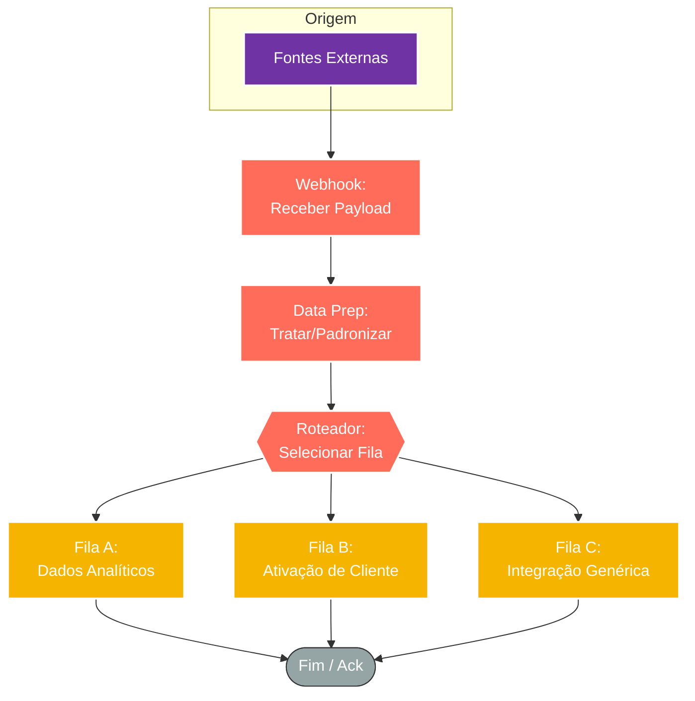

## ⚡ Gateway de Ingestão de Eventos e Roteamento (Webhooks > Message Broker)

#### 🧠 Lógica do Processo: Este padrão arquitetural funciona como um **Roteador de Alta Disponibilidade**. O objetivo é desacoplar a recepção de dados do seu processamento pesado. O fluxo recebe requisições HTTP de diversas **Fontes Externas** (Plataformas de Vendas, CRMs, Formulários), realiza uma normalização rápida dos dados (padronização de telefone, extração de IDs, tratamento de UTMs) e despacha o payload imediatamente para uma fila específica no **Message Broker** (Sistema de Mensageria). Isso garante que a fonte externa receba um "200 OK" instantâneo, evitando timeouts, enquanto assegura a persistência dos dados para processamento posterior (assíncrono).

---

### 🏗️ Diagrama de Arquitetura:

---

### 🔍 Dicionário de Dados

#### 1. Ingestão (Entrada)

* **Gatilho Webhook** `(Nó: Webhook Receiver)`
* **Função:** Ponto de Entrada. Rotas distintas configuradas para receber JSONs de diferentes eventos (vendas, leads, atualizações).
* **Estratégia:** Configurado para resposta imediata, atuando puramente como coletor de dados brutos sem executar lógica de negócio complexa neste estágio.

#### 2. Normalização (ETL Leve)

* **Tratamento de Dados** `(Nó: Data Transformation)`
* **Função:** Higienização. Antes do envio para a fila, o fluxo padroniza os dados críticos para facilitar o consumo posterior:
* **Contatos:** Remoção de códigos de país duplicados ou formatação de strings numéricas.
* **Identificadores:** Consolidação de IDs de transação ou clientes para rastreabilidade única.
* **Rastreamento:** Mapeamento de parâmetros de origem (UTMs) para atribuição correta.

#### 3. Mensageria (Saída)

* **Produtor de Mensagem** `(Nó: Message Broker Producer)`
* **Função:** Buffer de Segurança.
* **Configuração Padrão:**
* **Alta Disponibilidade:** Uso de filas replicadas (Quorum) para evitar perda de dados.
* **Persistência:** Configuração durável (Durable) para garantir que o evento sobreviva a reinicializações do servidor.

* **Roteamento:** O destino (Fila) é selecionado dinamicamente com base no tipo de evento recebido, segregando responsabilidades (ex: fila de vendas vs. fila de suporte).

