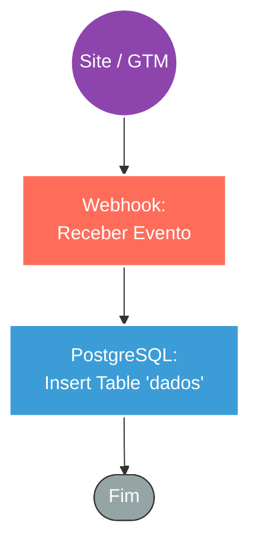

## ⚡ Sistema de Ingestão de Rastreamento Web (Meta Ads/Pixel)

#### 🧠 Lógica do Processo: Este workflow funciona como um coletor de dados de rastreamento "Server-Side" para campanhas de marketing (Meta Ads). Ele recebe eventos de navegação capturados no front-end (geralmente via Google Tag Manager ou scripts de tracking), contendo parâmetros críticos de atribuição como `fbclid`, `fbp` e `User Agent`. O sistema ingere esses dados via **Webhook** e os persiste imediatamente em uma tabela estruturada no **PostgreSQL** (`dados`). Esse armazenamento cria um histórico confiável para atribuição de conversões, auditoria de tráfego e suporte a implementações futuras de CAPI (Conversion API).

---

### 🏗️ Diagrama de Arquitetura:

---

### 🔍 Dicionário de Dados

#### 1. Coleta de Dados (Ingestão)

* **Webhook de Rastreamento** `(Nó: Webhook)`
* **Função:** Listener HTTP POST. Recebe o payload JSON contendo os dados de navegação do usuário.
* **Dados Recebidos:**
* `uniqueId`: Identificador único do evento ou sessão.
* `fbParams`: Objeto contendo os cookies do Facebook (`fbc`, `fbp`, `fbclid`) essenciais para o matching de anúncios.
* `client_user_agent`: A "impressão digital" do navegador do usuário.
* `url` e `origin`: A página exata onde o evento ocorreu.

#### 2. Armazenamento (Data Warehouse)

* **PostgreSQL** `(Nó: Postgres)`
* **Função:** Persistência. Insere uma nova linha na tabela `public.dados` para cada evento recebido.
* **Mapeamento de Colunas:**
* **Rastreabilidade:** `fbc` (Click ID) e `fbp` (Browser ID) são armazenados separadamente para permitir o cruzamento de dados com a API de Conversões do Facebook.
* **Contexto:** `event_source_url` e `action_source` registram a origem do tráfego.
* **Auditoria:** `client_user_agent` é salvo para validar a qualidade do tráfego e detectar bots.
