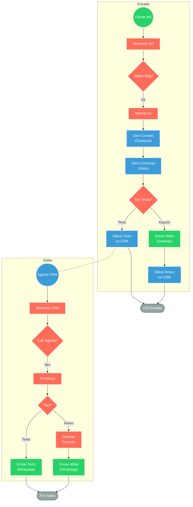

## ⚡ Integração Bidirecional Chatwoot ↔️ WhatsApp API

#### 🧠 Lógica do Processo
Este sistema atua como um middleware de comunicação que sincroniza mensagens entre o WhatsApp (conectado via **API Gateway**) e a plataforma de atendimento Chatwoot. O fluxo é segmentado em duas vias: **Entrada**, que recebe as mensagens dos clientes, verifica a existência do contato no CRM e registra o histórico na caixa de entrada (Inbox) apropriada; e **Saída**, que captura as respostas dos agentes no Chatwoot, processa os arquivos enviados (detectando o tipo MIME) e encaminha para o WhatsApp do cliente. O sistema inclui validações de segurança para ignorar grupos e evitar loops de mensagens enviadas pela própria automação.

---

### 🏗️ Diagrama de Arquitetura

---

### 🔍 Dicionário de Dados

#### 1. Canais de Comunicação

* **WhatsApp API Gateway** `(Nodes: WebhookData, Envio de Msgs)`
* **Função:** Interface de conexão externa com a rede do WhatsApp.
* **Entrada principal:** Webhooks de eventos (mensagens de texto, áudio, imagens e arquivos).
* **Saída principal:** Requisições HTTP POST para entrega de mensagens ao número do cliente.
* **Observações:** O workflow filtra eventos de grupos e mensagens com flag de autoria (`fromMe`) para evitar duplicidade e loops.

* **Chatwoot CRM** `(Nodes: WebhookDataChatwoot, Gestão de Contatos)`
* **Função:** Plataforma central de atendimento humano.
* **Entrada principal:** Criação/Atualização de contatos, gestão de Inbox e inserção de conversas.
* **Saída principal:** Webhooks do evento `message_created` (disparado quando o agente responde).
* **Observações:** Utiliza `inbox_id` e `account_id` para roteamento correto dentro dos departamentos.

#### 2. Lógica e Orquestração (n8n)

* **Gestor de Contatos** `(Nodes: contactFind, contactCreate, contactUpdate)`
* **Função:** Sincronização e deduplicação da base de clientes.
* **Regra:** Busca pelo identificador (telefone). Se inexistente, cria o registro. Se existente mas com nome genérico ("Contato"), atualiza com os dados do perfil público do WhatsApp.

* **Processador de Mídia** `(Nodes: messageMediaFields, messageMediaDownload)`
* **Função:** Tratamento e conversão de arquivos.
* **Entrada:** URLs de mídia fornecidas pelo Gateway.
* **Saída:** Dados binários prontos para upload ou links diretos com `MimeType` e extensão calculados dinamicamente (ex: `.pdf`, `.jpg`, `.ogg`).

