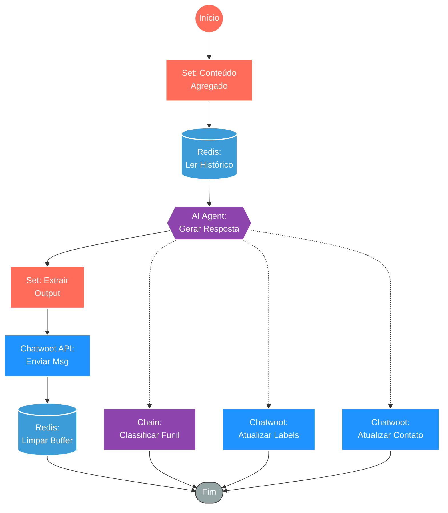

## ⚡ Agente de Conversação Inteligente com Memória e Classificação (Chatwoot)

#### 🧠 Lógica do Processo: Este workflow atua como o "cérebro" do atendimento automatizado. Acionado após a agregação de mensagens do usuário, ele recupera o contexto histórico da conversa armazenado no **Redis** para manter a coerência do diálogo. O núcleo do processamento é um **Agente de IA** (LangChain com GPT-4o-mini) que interpreta a intenção do usuário e gera uma resposta contextualizada. Após gerar a resposta, o sistema realiza múltiplas ações: envia a mensagem de volta para o **Chatwoot**, limpa o buffer de mensagens no Redis e, paralelamente, executa rotinas de enriquecimento de dados (atualização de etiquetas e dados do contato) e classificação de estágio de funil.

---

### 🏗️ Diagrama de Arquitetura:

---

### 🔍 Dicionário de Dados

#### 1. Preparação e Contexto

* **Preparação de Mensagem** `(Nó: contentMesssage)`
* **Função:** Input. Recebe as mensagens acumulada do usuário (agregadas em um fluxo anterior) para serem enviadas como um único bloco de texto para a IA, otimizando tokens e contexto.

* **Memória de Conversa** `(Nó: memoryConversation)`
* **Função:** Context Window. Conecta-se ao **Redis** utilizando uma `sessionKey` específica para recuperar as últimas trocas de mensagens. Isso permite que a IA "lembre" do que foi dito anteriormente (TTL de 900s).

#### 2. Inteligência Artificial (Núcleo)

* **Agente de Conversação** `(Nó: agentConversation)`
* **Função:** Orquestrador. Combina o modelo de linguagem (GPT-4o-mini), a memória recuperada e o prompt do sistema (instruções de tom, regras de negócio e formato de saída) para processar a entrada e gerar a resposta final.

* **Classificador de Funil** `(Nó: funnelStageChain)`
* **Função:** Inteligência de Vendas. Um sub-agente ou chain que analisa o teor da conversa para determinar em qual estágio do funil o lead se encontra, permitindo segmentação automática.

#### 3. Ação e Persistência

* **Envio Chatwoot** `(Nó: sendChatwootMessage)`
* **Função:** Resposta ao Cliente. Executa um `POST` na API do Chatwoot para entregar a resposta gerada pela IA na caixa de entrada da conversa.

* **Limpeza de Buffer** `(Nó: resetMessageAgregated)`
* **Função:** Gestão de Estado. Remove as mensagens do usuário do banco temporário (Redis) após o processamento, preparando o sistema para o próximo turno de fala sem duplicidade.

* **Atualizações de CRM** `(Nós: updateChatwootLabels / Contact)`
* **Função:** Enriquecimento. Atualiza automaticamente as etiquetas da conversa e os atributos do contato no Chatwoot com base nas informações extraídas ou geradas durante a interação com a IA.

