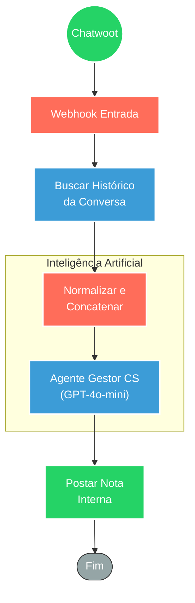

## ⚡ Análise de Conversa para Melhoria no Atendimento ao Cliente

#### 🧠 Lógica do Processo
Este workflow atua como um **auditor de qualidade automatizado** para equipes de Suporte e Customer Success. Ao receber um gatilho do Chatwoot (webhook), o sistema busca o histórico completo das mensagens daquela conversa específica via API. Em seguida, os dados são higienizados e consolidados em uma transcrição única. O núcleo da inteligência utiliza um Agente de IA (powered by GPT-4o-mini) com uma persona de "Gestor de CS" para analisar o diálogo, identificando tom, conflitos, acertos e pontos de melhoria. Por fim, o relatório gerado é postado automaticamente como uma **nota privada** na própria conversa no Chatwoot, fornecendo feedback imediato para a equipe sem interferir na visão do cliente.

---

### 🏗️ Diagrama de Arquitetura

---

### 🔍 Dicionário de Dados

#### 1. Coleta e Preparação de Contexto

* **Webhook Chatwoot** `(Nó: webhookDataChatwoot)`
* **Função:** Gatilho inicial. Recebe o evento da plataforma de atendimento contendo o ID da conversa e metadados básicos.

* **API de Leitura** `(Nó: getMessages)`
* **Função:** Recuperação de contexto. Realiza uma consulta autenticada à API do Chatwoot para baixar todas as mensagens trocadas naquela sessão, garantindo que a IA tenha visão completa do diálogo (cliente e agente).

* **Agregador de Dados** `(Nós: splitMessages, summarizeMessages)`
* **Função:** Pré-processamento. Separa as mensagens brutas, simplifica o payload (mantendo apenas remetente, conteúdo e data) e concatena tudo em um único bloco de texto cronológico para facilitar a leitura pela IA.

#### 2. Análise Cognitiva (IA)

* **Agente de CS** `(Nó: agentMessages)`
* **Função:** O "Cérebro" da operação. Utiliza um *System Prompt* avançado para atuar como um especialista em Customer Success.
* **Análise:** Avalia o tom da conversa, identifica solicitações, detecta conflitos/mal-entendidos e sugere melhorias na abordagem do atendente.
* **Motor:** Conectado ao modelo `gpt-4o-mini` da OpenAI para processamento eficiente e de baixo custo.

#### 3. Entrega de Feedback

* **API de Escrita** `(Nó: sendResumeConversation)`
* **Função:** Feedback Loop. Envia o relatório gerado pela IA de volta para o Chatwoot.
* **Configuração:** O envio é feito como uma **mensagem privada** (`private: true`), visível apenas para os agentes e gestores, servindo como ferramenta de treinamento e registro de qualidade.
