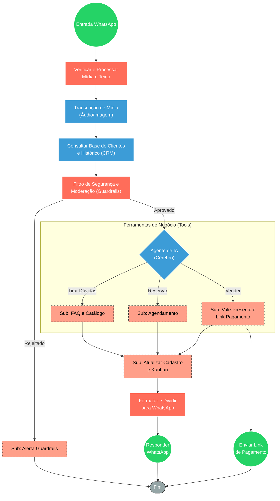

## ⚡ Assistente Virtual Premium com IA e Roteamento de Vendas (Lia)

#### 🧠 Lógica do Processo: Este sistema atua como o motor inteligente de atendimento via WhatsApp para um Spa Premium. Ao receber mensagens de texto, áudios ou imagens, o fluxo processa a mídia e consulta o CRM para obter o histórico do cliente e sua etapa no funil de vendas (Kanban). Após validação por uma camada de segurança (Guardrails), a interação é assumida por um Agente de IA  capaz de compreender a intenção do cliente. Com base no contexto, a IA aciona subfluxos especializados para tirar dúvidas (FAQ), realizar reservas ou vender vales-presente gerando links de pagamento integrados. Finalizada a resposta, o sistema atualiza automaticamente a etapa do cliente no CRM e formata a mensagem para envio fluido via WhatsApp.

---

### 🏗️ Diagrama de Arquitetura:

---

### 🔍 Dicionário de Dados

#### 1. Entrada e Roteamento Multimídia
Webhook WhatsApp (Nó: Webhook)

Função: Ponto de entrada das comunicações dos clientes no Spa.

Entrada principal: Eventos do WhatsApp (texto, áudio, imagens e contatos).

Saída principal: Dados brutos da mensagem roteados para o tratamento de mídia.

Observações: O fluxo identifica se a mensagem é um áudio, imagem ou texto puro para processamento dinâmico.

#### 2. Processamento de Mídia e IA Auxiliar
Transcrição OpenAI (Nós: Transcribe a recording / Transcreve imagem)

Função: Traduzir mídias em texto estruturado para que o agente principal compreenda a necessidade do cliente.

Entrada principal: Arquivo de áudio (Whisper) ou Imagem de referência (Vision).

Saída principal: Texto formatado (transcrição ou descrição da imagem) para injeção no prompt do agente de atendimento.

#### 3. Banco de Dados e Histórico (CRM)
Banco de Dados Clientes (Nó: consultaCrm)

Função: Recuperar o contexto do cliente no CRM, identificando nome, etapa no Kanban, compras pendentes e as últimas 30 mensagens trocadas.

Entrada principal: ID do contato e Número de telefone.

Saída principal: Contexto rico (histórico de chat estruturado) para alimentar a memória do Agente de IA.

#### 4. Moderação e Segurança
Filtro de Segurança Guardrails (Nós: Guardrails)

Função: Proteger a identidade da IA e a operação do Spa contra prompts maliciosos (jailbreak) e conteúdo inadequado (NSFW).

Entrada principal: Mensagem do cliente (texto ou transcrição).

Saída principal: Aprovação de fluxo contínuo ou acionamento de um subfluxo de alerta para intervenção humana.

Observações: Possui regras de exceção refinadas para o contexto de saúde/spa, ignorando falsos positivos sobre corpo e nudez em ambientes terapêuticos.

#### 5. Orquestração Cognitiva (Agente)
Agente de IA  (Nó: AI Agent)

Função: Cérebro do atendimento. Analisa a intenção do usuário, decide qual ferramenta usar e gera a resposta empática baseada na persona do Spa.

Entrada principal: Intenção do usuário e histórico da conversa.

Saída principal: Resposta redigida no tom de voz da marca e comandos estruturados em JSON para avançar o cliente de fase no funil.

#### 6. Ferramentas de Negócio (Tools / Sub-workflows)
Sub: FAQ Zenith (Nó: FAQ)

Função: Fornecer conhecimento especializado sobre terapias, preços, durações e indicações do catálogo do Spa.

Sub: Agendamento (Nó: Agendamento)

Função: Gerar links específicos por unidade física para concluir reservas.

Sub: Vendas e Pagamento (Nó: ValePresente)

Função: Conduzir fluxos de compra de vale-presente e integrar-se a gateways financeiros (InfinitePay) para gerar URLs de checkout automático.

#### 7. Gestão de Funil e Pós-Processamento
Atualização de CRM (Nós: KanbanSwitch, Kanban → status, SalvarNome)

Função: Refletir no sistema interno (painel de atendimento) a real etapa em que a negociação se encontra após a atuação da IA.

Entrada principal: Comandos categorizados devolvidos pelo LLM (ex: payment_sent, novo_contato).

Saída principal: Cards do Trello/Kanban movidos e cadastros atualizados para acompanhamento da equipe humana.
