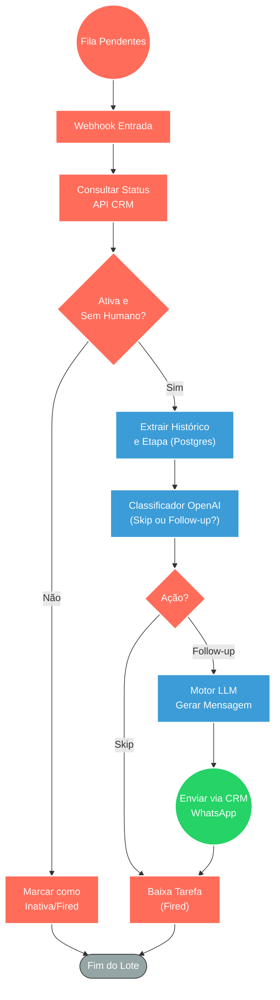

## ⚡ Sistema Automatizado de Follow-up Inteligente com IA

#### 🧠 Lógica do Processo
Este fluxo automatiza o processo de recuperação e follow-up para clientes que pararam de responder no WhatsApp. O sistema recebe uma lista de conversas inativas e verifica no CRM se o atendimento ainda está em aberto e sem atribuição humana. Com a confirmação, ele consulta o banco de dados para recuperar o histórico recente do chat e utiliza uma IA classificadora para decidir se a conversa foi naturalmente encerrada ou se exige um retorno. Caso precise de follow-up, uma IA generativa redige uma mensagem empática e personalizada baseada no último assunto discutido, envia diretamente pelo CRM e dá baixa na tarefa no gerenciador externo.

---

### 🏗️ Diagrama de Arquitetura:

---

### 🔍 Dicionário de Dados

#### 1. Entrada de Pendências

* **Webhook de Fila** `(Nó: Webhook / Split Pendentes)`
* **Função:** Ponto de entrada que recebe chamadas externas contendo lotes de conversas que atingiram o tempo limite de inatividade e precisam de follow-up.
* **Entrada principal:** Array JSON de contatos pendentes (IDs de conversa, IDs de contato e telefones).
* **Saída principal:** Dados fracionados para processamento individual em loop (Split In Batches).

#### 2. Validação e Contexto

* **Integração CRM** `(Nós: Verificar Conversa CRM)`
* **Função:** Atuar como trava de segurança, confirmando se a conversa ainda está "resolvida" ou se já foi assumida por um atendente humano.
* **Entrada principal:** ID da conversa.
* **Saída principal:** Status do ticket e identificador de atribuição (assignee).

* **Consulta de Histórico** `(Nó: consultaCrm / Postgres)`
* **Função:** Fornecer memória e contexto para a IA. Busca o nome limpo do cliente, etapa atual no funil (Kanban) e as últimas 30 mensagens trocadas.
* **Entrada principal:** ID do contato.
* **Saída principal:** Objeto rico contendo `nome_cliente`, `etapa_kanban` e o `chat_history`.

#### 3. Inteligência Artificial

* **Classificador de Intenção** `(Nó: Classificador — Skip ou Follow-up?)`
* **Função:** Evitar envios inoportunos. Analisa o histórico para entender se a última mensagem do bot já encerrou naturalmente o assunto (ex: "Bom final de semana") ou se deixou uma solicitação em aberto.
* **Entrada principal:** Histórico formatado do chat.
* **Saída principal:** Tag de roteamento (`skip` ou `followup`).

* **Motor Generativo de Resgate** `(Nós: Basic LLM Chain / Gemini & OpenAI)`
* **Função:** Redigir a mensagem de follow-up de forma empática, natural e não-robótica, conectando-se exatamente com a última pergunta ou tópico que ficou sem resposta.
* **Entrada principal:** Prompt de sistema com regras restritas de tom de voz e o histórico de mensagens.
* **Saída principal:** Texto final aprovado e estruturado no padrão de saída JSON.

#### 4. Saída e Conclusão

* **Envio e Baixa de Tarefas** `(Nós: Enviar Follow-up / Marcar Fired)`
* **Função:** Despachar a mensagem gerada para o cliente pelo canal oficial do WhatsApp e sinalizar ao orquestrador externo que o processo desta conversa foi concluído.
* **Entrada principal:** Mensagem textual gerada e ID da conversa.
* **Saída principal:** Requisições HTTP (POST) que disparam a mensagem no CRM e dão baixa no serviço de cron/follow-up (Worker).
