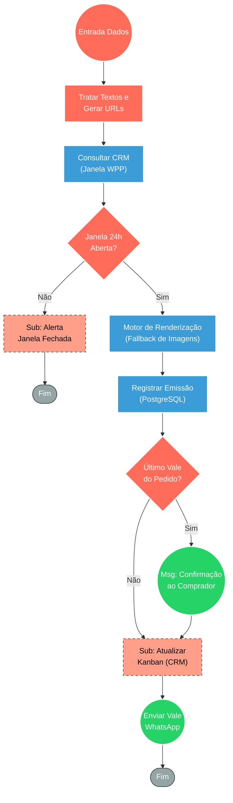

## ⚡ Motor de Emissão e Envio de Vale-Presente

#### 🧠 Lógica do Processo
Este fluxo é responsável pela emissão automatizada de vales-presente digitais de um Spa Premium. Ao receber os dados de compra, o sistema trata as informações textuais (capitalização, abreviações) e utiliza geradores dinâmicos de imagem baseados em URL para criar a arte do vale com o nome da presenteada, o serviço/valor e a validade. Antes do disparo, o workflow valida no CRM se a janela de 24 horas do WhatsApp está ativa para o comprador. Estando liberado, o sistema executa uma cadeia de fallback para a geração da imagem, atualiza o status de entrega no banco de dados e dispara o arquivo visual pelo WhatsApp. Caso seja o último vale de um pedido múltiplo, uma mensagem de confirmação final é enviada ao comprador, e o status no funil de vendas (Kanban) é automaticamente atualizado.

---

### 🏗️ Diagrama de Arquitetura:

---

### 🔍 Dicionário de Dados

#### 1. Orquestração e Estruturação de Dados

* **Entrada de Pedido** `(Nós: start / Gerar URLs)`
* **Função:** Ponto de ignição do fluxo. Recebe os parâmetros brutos do pedido (comprador, presenteado, serviços, valores) e realiza o tratamento intensivo de texto. Prepara as URLs dinâmicas para a criação da imagem visual.
* **Entrada principal:** Objeto contendo os dados do presente (ex: `nome_presenteada`, `modalidade`, `valor_reais`, `order_nsu`).
* **Saída principal:** Variáveis limpas e prontas para renderização gráfica e mensagens.

#### 2. Integração com CRM de Atendimento

* **Validador de Janela 24h** `(Nós: Buscar Contato CRM / Verificar Janela 24h / If)`
* **Função:** Evitar bloqueios e falhas de envio consultando a API externa para validar se a sessão do WhatsApp do cliente permite disparos ativos.
* **Entrada principal:** Telefone do comprador.
* **Saída principal:** Status de liberação da sessão (Aberto/Fechado).
* **Observações:** Se a janela estiver fechada, a automação aborta a rota de disparo padrão e aciona o subfluxo de notificação para intervenção humana (`Alerta Janela 24h WhatsApp`).

#### 3. Motor Dinâmico de Imagens (Renderização e Alta Disponibilidade)

* **Geradores de Fallback** `(Nós: Testar Cloudinary / ImageKit / nifty)`
* **Função:** Criar a arte digital final do vale-presente sobrepondo textos formatados em um template. Utiliza uma estratégia de tolerância a falhas (chain of responsibility) para testar provedores em sequência.
* **Entrada principal:** Links parametrizados com coordenadas e textos via Base64.
* **Saída principal:** O primeiro link (`media_url`) que retornar processamento com sucesso (código 200).

#### 4. Controle de Estado e Consistência (Banco de Dados)

* **Persistência de Emissão** `(Nós: DB Update Vale Enviado / Verificar último vale)`
* **Função:** Registrar a efetivação do envio no PostgreSQL para manter o rastreio, associando a arte gerada ao pedido correspondente. Também atua como um contador agrupador para pedidos com múltiplos vales.
* **Entrada principal:** `order_nsu` (ID do pedido), `indice` e a URL da imagem.
* **Saída principal:** Booleano confirmando se aquele processamento concluiu a emissão total do lote comprado.

#### 5. Comunicação e Fechamento

* **Disparo WhatsApp** `(Nós: Confirmar ao Comprador / Enviar Vale WhatsApp1)`
* **Função:** Realizar a entrega das mensagens finais pela API do CRM, despachando primeiro uma notificação textual de sucesso para o comprador (apenas no fim do lote) e enviando a imagem anexa do presente.
* **Entrada principal:** Textos gerados pelo nó de montagem e URL extraída dos geradores gráficos.
* **Saída principal:** Envio das mensagens consolidadas para o contato oficial do cliente.

* **Gestão de Pipeline** `(Nós: kanban / kanban1)`
* **Função:** Sub-workflows focados em manter o ecossistema sincronizado. Eles alteram visualmente o ticket do cliente no Kanban de vendas para o status `gift_sent`, garantindo a transparência operacional para a equipe humana.
