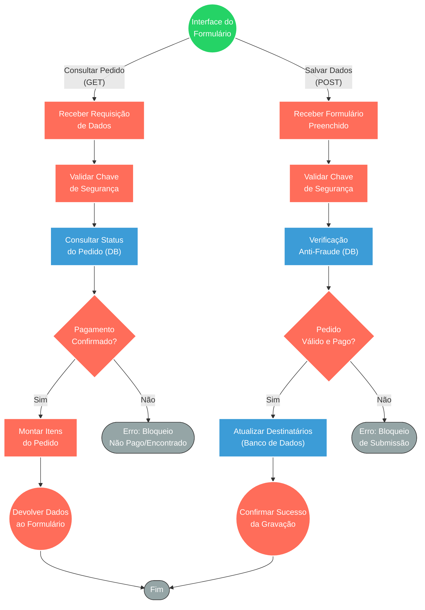

## ⚡ API de Gestão e Resgate de Vales-Presente

#### 🧠 Lógica do Processo
Este sistema atua como o backend (API) de um formulário externo onde os clientes preenchem os dados de quem receberá os vales-presente adquiridos. O sistema é dividido em duas rotas essenciais: uma rota de consulta (GET) que valida de forma segura se o pedido existe e já teve seu pagamento confirmado antes de liberar as informações para a tela do usuário; e uma rota de submissão (POST) que recebe os dados preenchidos (nome, telefone, unidade), passa por uma validação anti-fraude e grava permanentemente o destino do presente no banco de dados. Ambas as rotas exigem chaves de segurança internas, garantindo que nenhum vale seja emitido sem pagamento ou por requisições não autorizadas.

---

### 🏗️ Diagrama de Arquitetura:

---

### 🔍 Dicionário de Dados

#### 1. Endpoints de Integração (Webhooks)

* **API de Interface (Rotas GET/POST)**
* **Função:** Pontos de entrada e saída que conectam a interface visual do cliente (front-end) com a inteligência do servidor. Operam a leitura para montar a tela e a escrita para salvar as respostas.
* **Entrada principal:** Requisições HTTP (cabeçalhos de segurança, IDs de pedidos e payloads com dados de compradores/presenteados).
* **Saída principal:** Respostas padronizadas em JSON com os dados do pedido (200 OK) ou códigos de erro HTTP estruturados (402, 403, 404).
* **Observações:** Possui verificação estrita via `x-internal-secret` para rejeitar tráfego de origens não autorizadas.

#### 2. Motor de Validação e Anti-Fraude

* **Validador Lógico de Pagamentos**
* **Função:** Atuar como um Guardião. Antes de permitir que o usuário veja o formulário ou grave dados, confirma no banco se a transação financeira daquele número de pedido (NSU) foi efetivamente paga.
* **Entrada principal:** Dados do pedido extraídos do banco de dados na etapa anterior.
* **Saída principal:** Roteamento que aprova o fluxo ou aciona nós de bloqueio, devolvendo respostas como "402 Payment Not Confirmed" ou "404 Not Found".

#### 3. Persistência de Dados

* **Banco de Dados de Vales (PostgreSQL)**
* **Função:** Repositório central de informações das vendas. Serve tanto para fornecer os dados originais da compra quanto para receber as atualizações feitas pelos clientes.
* **Entrada principal:** Na gravação (POST), recebe os nomes, telefones, CPF e unidade escolhida associados a um `order_nsu` e um `indice`.
* **Saída principal:** Na leitura (GET), devolve a lista de vales vinculados àquele pedido para exibição dinâmica no formulário.
* **Observações:** O salvamento sinaliza o registro como concluído por meio de uma flag (`form_preenchido = true`), habilitando o pedido para as próximas etapas de automação (como a geração da imagem e envio por WhatsApp).
