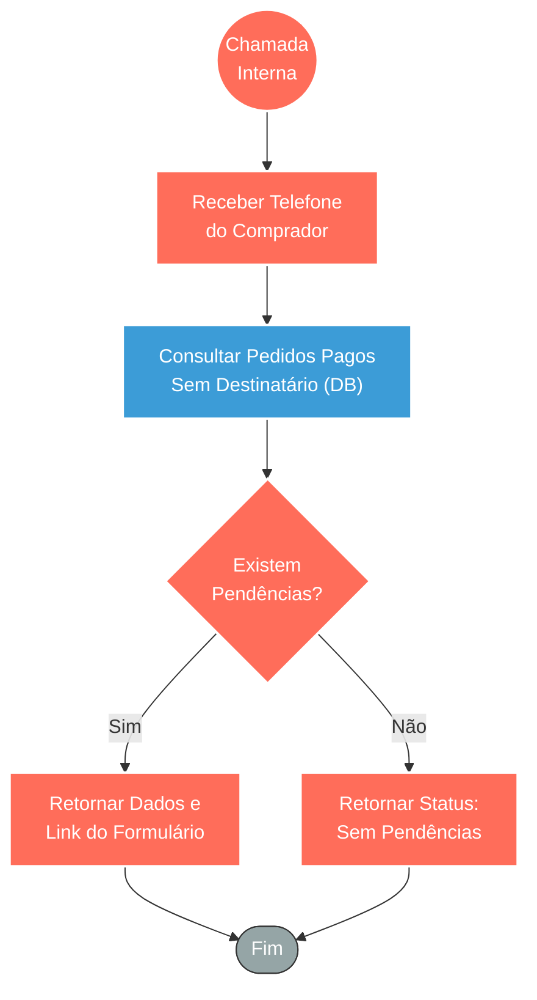

## ⚡ Ferramenta de Verificação de Coleta Pendente

#### 🧠 Lógica do Processo
Este fluxo atua como uma ferramenta de consulta interna (subfluxo ou tool para IA) focada em resgatar pendências de clientes. Ao ser acionado com o telefone de um comprador, ele verifica ativamente no banco de dados se existem pedidos de vale-presente que já foram pagos, mas cujos dados dos presenteados ainda não foram informados (coleta pendente). Com base nessa busca, o sistema toma uma decisão simples: se houver pendências, ele retorna os detalhes do pedido junto com o link do formulário para o cliente preencher; caso contrário, sinaliza que não há ações pendentes, permitindo que o bot ou sistema principal direcione o atendimento adequadamente.

---

### 🏗️ Diagrama de Arquitetura:

---

### 🔍 Dicionário de Dados

#### 1. Entrada de Dados

* **Gatilho de Subfluxo** `(Nó: toolVerificar)`
* **Função:** Ponto de entrada que permite que este fluxo seja chamado por outros workflows principais (como um orquestrador de IA ou fluxo de atendimento).
* **Entrada principal:** Número de telefone do comprador (`telefone_comprador`).
* **Saída principal:** Repasse do dado de contato para a etapa de pesquisa no banco de dados.

#### 2. Consulta de Informações (Banco de Dados)

* **Busca de Pedidos Pendentes** `(Nó: SELECT Coleta Pendente)`
* **Função:** Consultar o banco de dados relacional para cruzar três regras de negócio: verificar se o pedido pertence ao telefone informado, se o pagamento foi efetivamente confirmado (`paid = true`) e se há vales gerados que ainda não tiveram o formulário de destinatário preenchido (`form_preenchido = false`).
* **Entrada principal:** Telefone do cliente.
* **Saída principal:** Lista de pedidos pendentes contendo número do pedido (NSU), serviço comprado, valor em reais e a URL de resgate dinâmica (formulário).

#### 3. Roteamento Lógico e Retorno

* **Validador de Resultados** `(Nó: Tem Coleta Pendente?)`
* **Função:** Avaliar se a consulta ao banco de dados retornou registros reais ou um array vazio, direcionando o caminho final da resposta.

* **Saídas do Sistema** `(Nós: Retornar Pendente / Retornar Sem Pendencia)`
* **Função:** Devolver o resultado formatado de volta ao workflow pai que fez a requisição.
* **Entrada principal:** Dados da pendência estruturados (se existirem) ou indicador de vazio.
* **Saída principal:** Confirmação em formato JSON informando o status do cliente para que o fluxo principal continue o fluxo de conversa ou ação pretendida.
