## ⚡ Sistema de Checkout e Confirmação de Pagamento (InfinitePay)

#### 🧠 Lógica do Processo
Este sistema gerencia o ciclo completo de pagamentos digitais do Spa integrado ao gateway da InfinitePay, operando em duas frentes conectadas. A primeira atua como uma ferramenta interna (Tool) que recebe os dados do carrinho, registra o pedido inicial no banco de dados e consome a API da adquirente para gerar um link de pagamento dinâmico. A segunda frente é reativa (Webhook): ela escuta a confirmação de que o pagamento foi concluído com sucesso, valida os dados no banco e efetiva a criação dos vales-presente. Para finalizar, o fluxo valida no CRM se a janela de 24 horas do WhatsApp do cliente está ativa, disparando o link do formulário de resgate diretamente no chat ou escalando para atendimento humano caso a janela esteja fechada.

---

### 🏗️ Diagrama de Arquitetura:

```mermaid
graph TD
    %% Estilos obrigatórios
    classDef whatsapp fill:#25D366,stroke:#fff,stroke-width:2px,color:#fff
    classDef n8n fill:#FF6D5A,stroke:#fff,stroke-width:2px,color:#fff
    classDef db fill:#3C9CD7,stroke:#fff,stroke-width:2px,color:#fff
    classDef subflow fill:#FF9F89,stroke:#333,stroke-width:1px,stroke-dasharray: 5 5,color:#000
    classDef endnode fill:#95a5a6,stroke:#333,color:#fff

    subgraph "Fase 1: Geração de Cobrança (Tool Interna)"
        StartTool((Requisição de<br/>Checkout)):::n8n --> InsertDB["Registrar Pedido<br/>Pendente (Postgres)"]:::db
        InsertDB --> Calc["Formatar Valores<br/>e Itens"]:::n8n
        Calc --> InfinitePayAPI["API InfinitePay<br/>(Gerar Link)"]:::db
        InfinitePayAPI --> URLDecision{Sucesso?}:::n8n
        URLDecision -- "Sim" --> ReturnLink([Retornar URL<br/>de Pagamento]):::endnode
        URLDecision -- "Não" --> ReturnError([Retornar Erro]):::endnode
    end

    subgraph "Fase 2: Confirmação Assíncrona (Webhook)"
        WebhookIP((Webhook<br/>InfinitePay)):::n8n --> CheckDB["Validar Pedido<br/>Pago (Postgres)"]:::db
        CheckDB --> CreateVales["Efetivar Geração<br/>dos Vales (DB)"]:::db
        CreateVales --> CRMQuery["Consultar CRM<br/>(Contato e Status)"]:::db
        CRMQuery --> Window{Janela 24h<br/>Aberta?}:::n8n
        
        Window -- "Sim" --> SendForm((Msg: Link do<br/>Formulário)):::whatsapp
        Window -- "Não" --> Alert["Sub: Alerta<br/>Janela Fechada"]:::subflow
        
        SendForm --> EndNode([Fim]):::endnode
        Alert --> EndNode
    end

```



---

### 🔍 Dicionário de Dados

#### 1. Orquestração de Cobrança (Tool)

* **Gatilho de Geração de Link** `(Nó: toolInfinity)`
* **Função:** Atuar como um serviço interno (Tool) consumível por outros fluxos (como IA ou bots de atendimento) para converter uma intenção de compra em uma cobrança real.
* **Entrada principal:** Dados dos serviços, modalidades, quantidade, identificador da sessão e telefone do comprador.
* **Saída principal:** Repasse dos dados para gravação no banco de dados.


* **API InfinitePay** `(Nó: POST InfinitePay)`
* **Função:** Comunicação com o gateway financeiro para emissão do link de checkout encriptado e pronto para o cliente final.
* **Entrada principal:** Payload formatado com os itens do carrinho e os valores convertidos em centavos.
* **Saída principal:** URL de pagamento ativa para devolução ao cliente.


#### 2. Confirmação e Conciliação (Webhook)

* **Receptor de Eventos (Webhook)** `(Nó: Webhook InfinitePay)`
* **Função:** Escutar de forma assíncrona as notificações enviadas pela InfinitePay indicando que uma transação foi concluída (IPN).
* **Entrada principal:** Payload JSON da adquirente contendo o `order_nsu` e o status da transação.
* **Saída principal:** Gatilho para início do fluxo de entrega do presente.


* **Banco de Dados (PostgreSQL)** `(Nós: Insert, Select, CRIAR vales_gerados)`
* **Função:** Manter o estado unificado das vendas. Na Fase 1, grava o "rascunho" do pedido; na Fase 2, confirma a venda e gera os registros definitivos dos vales para posterior consumo pelo formulário de resgate.
* **Entrada principal:** Detalhes de pedido (Inserção) e ID do pedido pago (Confirmação).
* **Saída principal:** Registros de `pedidos_vale_presente` consolidados e inserções em lote na tabela `vales_gerados`.


#### 3. Comunicação Pós-Venda

* **Validador de Janela CRM** `(Nós: Buscar Contato CRM / Verificar Janela 24h)`
* **Função:** Evitar penalidades no canal oficial do WhatsApp garantindo que o envio só ocorra se a sessão com o usuário permitir mensagens ativas.
* **Entrada principal:** Telefone do comprador registrado no ato da compra.
* **Saída principal:** Decisão binária (Verdadeiro/Falso) sobre a permissão de envio.
* **Observações:** O bloqueio da janela aciona um sub-workflow de alerta interno (`Alerta Janela 24h WhatsApp`) para que um humano intervenha na entrega.


```

```
