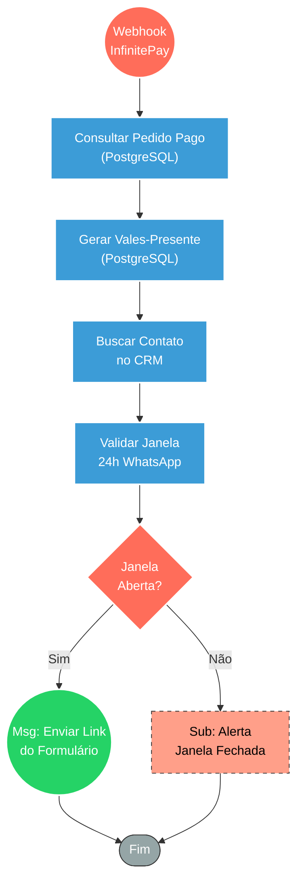

## ⚡ Webhook de Confirmação de Pagamento InfinitePay

#### 🧠 Lógica do Processo
Este fluxo opera como um ouvinte assíncrono (webhook) para o gateway InfinitePay, sendo acionado automaticamente assim que um pagamento é confirmado. Ao receber o evento, o sistema consulta o banco de dados para validar as informações da compra e, em seguida, efetiva a criação dos registros dos vales-presente. Com os vales criados, o fluxo consulta o CRM para verificar se o cliente possui a janela de 24 horas do WhatsApp aberta, garantindo um envio seguro. Se permitido, dispara imediatamente uma mensagem contendo o link do formulário para o resgate do presente; caso contrário, aciona um subfluxo de alerta interno para intervenção da equipe humana.

---

### 🏗️ Diagrama de Arquitetura:

---

### 🔍 Dicionário de Dados

#### 1. Entrada de Notificação Financeira

* **Webhook InfinitePay** `(Nó: Webhook)`
* **Função:** Ponto de entrada assíncrono. Recebe a notificação (IPN) do gateway de pagamento confirmando que a transação foi aprovada, servindo como gatilho para a entrega do produto.
* **Entrada principal:** Payload da InfinitePay contendo o identificador da transação (`order_nsu`).
* **Saída principal:** Extração do ID do pedido para a consulta e validação no banco de dados.

#### 2. Validação e Persistência de Dados

* **PostgreSQL (Consulta e Criação)** `(Nós: Postgres / CRIAR vales_gerados)`
* **Função:** Núcleo de gestão do estado do pedido. Primeiramente, valida se o pedido existe e recupera detalhes essenciais (modalidade, valor, quantidade, telefone do comprador). Após a validação, executa a criação formal dos registros de vales-presente no sistema para possibilitar o resgate.
* **Entrada principal:** `order_nsu` (ID do pedido).
* **Saída principal:** Registros de vales inseridos na base e URL dinâmica do formulário de resgate preparada para o envio.

#### 3. Integração CRM e Regras de Segurança

* **Validação de Canal e Contato** `(Nós: Buscar Contato CRM / Verificar Janela 24h)`
* **Função:** Atuar como camada de segurança de comunicação. Comunica-se com o sistema de atendimento para verificar a existência do contato e checar se há uma sessão ativa no WhatsApp, evitando bloqueios na linha oficial por disparos de spam.
* **Entrada principal:** Telefone do comprador.
* **Saída principal:** Flag de status indicando se o envio proativo de mensagem via WhatsApp está autorizado pela janela de 24h.

#### 4. Comunicação e Transbordo

* **Disparo Automático de Formulário** `(Nó: Enviar Link Formulário)`
* **Função:** Rota de sucesso. Envia de forma automatizada e instantânea a mensagem contendo o link do formulário onde o cliente preencherá os dados do presenteado.
* **Entrada principal:** Telefone validado, nome e URL do formulário associada ao pedido.
* **Saída principal:** Mensagem entregue no WhatsApp do cliente através da API do CRM.

* **Alerta Operacional** `(Nó: Zenith — Alerta Janela 24h WhatsApp)`
* **Função:** Fluxo de contingência (fallback). Quando a janela do WhatsApp do cliente está fechada (impedindo o envio automático), este sub-workflow notifica a equipe interna para realizar o contato manual e garantir a entrega do link, mantendo a excelência do atendimento.
