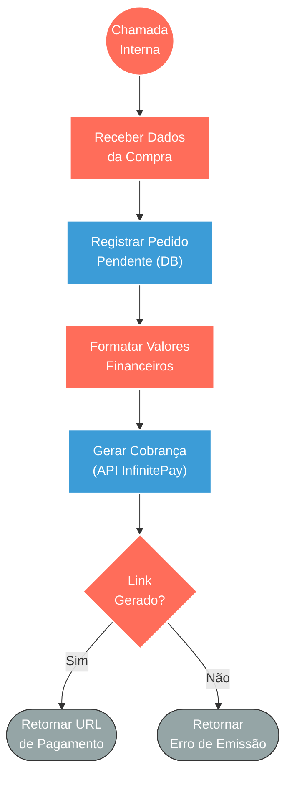

## ⚡ Ferramenta de Geração de Cobrança InfinitePay

#### 🧠 Lógica do Processo
Este fluxo atua como um submódulo interno (tool) responsável por orquestrar a etapa de checkout na venda de vales-presente. Ao ser acionado pelo sistema principal com os dados do serviço escolhido, ele primeiramente registra uma intenção de compra ("rascunho") no banco de dados para garantir o rastreio da negociação. Em seguida, realiza a formatação e conversão monetária dos valores para o padrão do gateway financeiro. Por fim, o sistema consome a API da InfinitePay para criar uma cobrança oficial, valida a resposta e devolve o link de pagamento seguro para que o fluxo de origem o entregue ao comprador.

---

### 🏗️ Diagrama de Arquitetura:

---

### 🔍 Dicionário de Dados

#### 1. Entrada de Requisição (Gatilho)

* **Receptor de Dados do Pedido** `(Nó: toolInfinity)`
* **Função:** Atuar como a porta de entrada para subfluxos ou agentes de IA. Recebe os parâmetros essenciais do carrinho escolhido pelo cliente (serviço, unidade, valor total, quantidade de vales e telefone de contato).
* **Entrada principal:** Objeto JSON contendo as informações da compra e dados de sessão do cliente.
* **Saída principal:** Repasse das variáveis estruturadas para o registro no banco de dados.

#### 2. Persistência e Controle de Vendas

* **Banco de Dados de Pedidos** `(Nós: INSERT Pedido pendente / Gravar itens_vale)`
* **Função:** Manter a rastreabilidade da operação comercial. Cria um registro inicial da venda no PostgreSQL com o status pendente ("rascunho"), associando os itens da compra e prevendo a URL de resgate.
* **Entrada principal:** Dados do carrinho e telefone do comprador.
* **Saída principal:** Confirmação da gravação no banco com os IDs de relacionamento daquela tentativa de compra.

#### 3. Integração Financeira

* **Gateway InfinitePay** `(Nós: Converter para centavos / POST InfinitePay)`
* **Função:** Transformar a intenção de compra em uma transação financeira real. Formata o valor monetário de Reais para centavos (padrão de adquirentes) e dispara a requisição de criação de link de pagamento junto à adquirente.
* **Entrada principal:** Valor do pedido, identificadores dos itens e dados de expiração do link.
* **Saída principal:** Resposta da API contendo a URL de checkout hospedada pela InfinitePay.

#### 4. Validação e Retorno (Saída)

* **Validador de Link e Conclusão** `(Nós: If / Retornar URL / Retornar Erro)`
* **Função:** Garantir a robustez do processo. Avalia se o gateway retornou o link de pagamento corretamente; se sim, envia o link (sucesso); caso a API falhe, devolve um aviso de erro para não travar o atendimento humano ou do bot.
* **Entrada principal:** Payload de resposta da InfinitePay.
* **Saída principal:** Devolução do link gerado ou notificação de falha para o fluxo (ou atendente) que solicitou a ferramenta.
